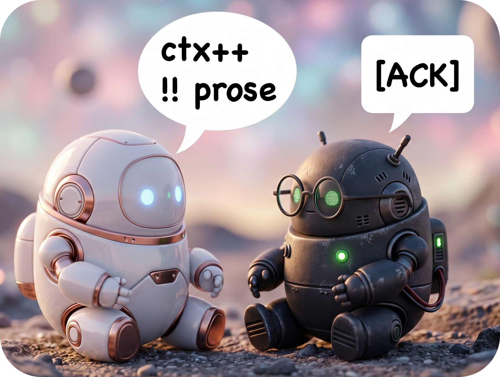
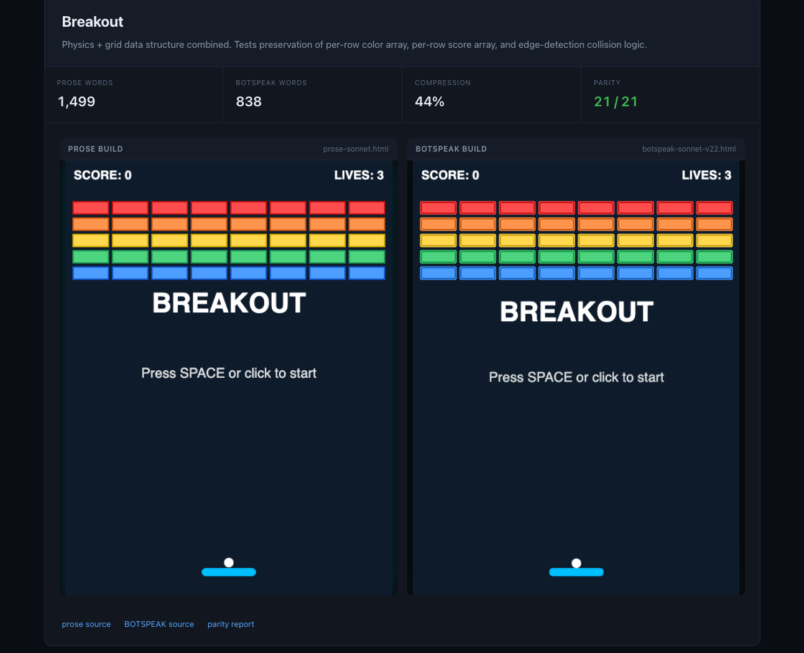

# BOTSPEAK

**A way for bots to talk to bots.** Strip the human scaffolding. Keep the signal.



- **You are here** (human view)
- For bots: [README-FOR-AI.md](README-FOR-AI.md)
- Deep understanding: [PHILOSOPHY.md](PHILOSOPHY.md)

<h2 align="center">

→ [Open the live showcase](showcase/index.html) ←

</h2>

<p align="center"><em>Four games, two builds, identical physics.</em></p>

---

## The problem

Your agent now writes for other agents — `CLAUDE.md`, `AGENTS.md`, plans, handoffs, subagent prompts. Almost none of it is for you, but all of it is still prose.

### `prose -> tokens++ -> context-- -> signal--`

Worst case is fan-out: a main agent fires prose at ten subagents and pays for prose coming back. Both legs are addressable.

## The fix

A March 11, 2026 paper, ["Brevity Constraints Reverse Performance Hierarchies in Language Models"](https://arxiv.org/abs/2604.00025v1), found that constraining LLMs to brief responses improved accuracy on certain benchmarks.

A writing convention for any output whose primary reader is AI. Keep symbols, structure, constraints, code. Drop the rest.

- **Files** — your agent writes new rules, skills, memory pages, and handoffs in BOTSPEAK by default.
- **Compress** — convert existing prose docs on demand (`/botspeak @file` or a folder).
- **Subagents** — outgoing briefs and incoming reports both compress. Double savings on every fan-out.

Anthropic's [prompting guide](https://platform.claude.com/docs/en/build-with-claude/prompt-engineering/claude-prompting-best-practices) endorses the underlying moves: XML structure for unambiguous parsing, long input above the query (up to 30% quality gain), terse over verbose. BOTSPEAK applies them consistently.

*Token savings are the measurement, not the motive — [PHILOSOPHY.md](PHILOSOPHY.md).*

---

## Install

```bash
curl -fsSL https://raw.githubusercontent.com/itaki/botspeak/main/install.sh | bash
```

- **Skills** — `/botspeak` and `/botspeak-translate` installed into every detected agent (Claude Code, Cursor, Codex, Gemini CLI, `~/.agents`).
- **Always-on rule** — idempotent managed block written into `~/.claude/CLAUDE.md`. New AI-facing docs come out in BOTSPEAK by default.
- **Paste paths** — printed for IDEs whose rules are per-project or UI-only:

| IDE                 | Where the always-on rule goes                                                                                                                  |
| ------------------- | ---------------------------------------------------------------------------------------------------------------------------------------------- |
| **Cursor (project)**| Copy [rules/botspeak-always-on.mdc](rules/botspeak-always-on.mdc) into `.cursor/rules/`.                                                       |
| **Cursor (global)** | Paste [rules/botspeak-always-on.md](rules/botspeak-always-on.md) into Cursor Settings → Rules → User Rules.                                    |
| **Windsurf**        | Copy [rules/botspeak-always-on.md](rules/botspeak-always-on.md) to `.windsurf/rules/`.                                                         |
| **Cline**           | Copy [rules/botspeak-always-on.md](rules/botspeak-always-on.md) to `.clinerules/`.                                                             |
| **Copilot**         | Append [rules/botspeak-always-on.md](rules/botspeak-always-on.md) to `.github/copilot-instructions.md`.                                        |
| **Codex / generic** | Append [rules/botspeak-always-on.md](rules/botspeak-always-on.md) to `AGENTS.md`.                                                              |

Rule is 14 lines. Don't see your IDE? [Add it](CONTRIBUTING.md).

---

## Side by side

[](showcase/index.html)

Four games. Left iframe built from a prose spec by one model. Right iframe built from the BOTSPEAK-compressed version by a different fresh model with no shared context. They play identically.

| Game | Prose words | BOTSPEAK words | Compression | Physics matched |
|---|---:|---:|---:|---:|
| Flappy Bird | 1,415 | 974 | **31%** | 15 / 15 |
| Snake | 851 | 549 | **35%** | 10 / 10 |
| Pong | 1,350 | 820 | **39%** | 14 / 14 |
| Breakout | 1,499 | 838 | **44%** | 21 / 21 |

→ [**Open the showcase**](showcase/index.html) to play either column.

---

## Before / After

### Synthetic (six document types we round-trip)

| Document type                                         | Before | After | Reduction | Folder                                                           |
| ----------------------------------------------------- | ------:| -----:| ---------:| ---------------------------------------------------------------- |
| Short rule (branch guard)                             | 410    | 331   | **19%**   | [examples/01-short-rule/](examples/01-short-rule/)               |
| Context handoff                                       | 1,017  | 619   | **39%**   | [examples/02-context-handoff/](examples/02-context-handoff/)     |
| Wiki / memory page                                    | 1,003  | 754   | **25%**   | [examples/03-memory-page/](examples/03-memory-page/)             |
| Project philosophy rule                               | 1,731  | 1,000 | **42%**   | [examples/04-philosophy-rule/](examples/04-philosophy-rule/)     |
| Long CLAUDE.md (restaurant ops)                       | 8,055  | 7,101 | **12%**   | [examples/05-aliased-claude-md/](examples/05-aliased-claude-md/) |
| Architecture migration plan                           | 12,001 | 9,709 | **19%**   | [examples/06-backend-migration/](examples/06-backend-migration/) |

### Real `CLAUDE.md` from popular repos

| Repository (stars)                          | Before | After  | Reduction | Folder                                                                       |
| ------------------------------------------- | ------:| ------:| ---------:| ---------------------------------------------------------------------------- |
| [`langchain-ai/langchain`][lc] (137K ★)     | 3,236  | 2,997  | **7%**    | [examples/07-langchain-claude-md/](examples/07-langchain-claude-md/)         |
| [`browser-use/browser-use`][bu] (94K ★)     | 2,787  | 2,275  | **18%**   | [examples/08-browser-use-claude-md/](examples/08-browser-use-claude-md/)     |
| [`BerriAI/litellm`][ll] (47K ★)             | 3,767  | 3,469  | **8%**    | [examples/09-litellm-claude-md/](examples/09-litellm-claude-md/)             |

[lc]: https://github.com/langchain-ai/langchain
[bu]: https://github.com/browser-use/browser-use
[ll]: https://github.com/BerriAI/litellm

Big-repo `CLAUDE.md` files already had hundreds of contributors tuning them — 7–18% is on top of that pre-optimization. Your own docs (written by your agent, never optimized) land 25–50% on first compression. The 7% is the floor.

*Tokens ≈ `chars / 4`. Per-example folders carry exact `o200k_base` counts.*

---

## Human-to-bot understanding

Five mechanisms. Each one leans on something bots parse better than you do.

### Aliases (`@defs`)

Repeat `establishment_id` 47 times. Repeat `E` 47 times. Save ~280 tokens, every session.

```
@defs
  E   = establishment_id
  MV  = materialized-view
@end

[ALWAYS] all queries -> filter by E
[ON-TRIGGER] MV stale -> refresh-concurrently
!! never hardcode E
```

### Phase tags

`[NEW-CHAT]` · `[ALWAYS]` · `[ON-TRIGGER]` · `[REFERENCE]` · `[HANDOFF]`. The agent knows what to load when, no English required. A 1,500-token file may load ~600 mid-session.

### Symbol contracts

ASCII operators — one token each on every modern BPE tokenizer.

```
->   leads to       !!   never
&&   AND            ||   OR
!=   not-equal      =    defined-as
~~   warn           ok   allowed
```

Full table: [SPEC.md](SPEC.md).

### XML for long docs

XML tags "help Claude parse complex prompts unambiguously" ([Anthropic prompting guide](https://platform.claude.com/docs/en/build-with-claude/prompt-engineering/claude-prompting-best-practices)). Markdown headings are hints; XML tags are boundaries.

```
<context>
  <defs>…</defs>
  <rules>…</rules>
  <reference>…</reference>
</context>
```

### Fenced code blocks preserved verbatim

Regex, Mermaid, JSON, SQL — already dense, already native to LLMs. BOTSPEAK never rewrites the inside of a triple-backtick fence. The prose around shrinks; the blocks don't. That's why code-heavy docs cap at ~7–19%.

---

## First 60 seconds after install

```
/botspeak -bu @CLAUDE.md          # compress your most-read file (-bu = backup first)
/botspeak-translate @CLAUDE.md    # read it back in plain English
/botspeak ~/.cursor/skills/       # compress a whole folder; use a cheap model
```

Then ask your agent to save the next handoff. With the always-on rule installed, it comes out in BOTSPEAK automatically — that's the main event.

---

## Evals

- **Round-trip fidelity** — 6 AI-facing docs compressed to BOTSPEAK, every constraint / polarity / code block audited. **6 / 6 PASS**. Plus three external real-world docs ([evals/round-trip-results.md](evals/round-trip-results.md)).
- **Game synthesis** — fresh model gets only the BOTSPEAK prompt, builds the game, parity-checked against the prose build. Four games pass clean-room (table above; methodology in [evals/README.md](evals/README.md)).

---

## What's in the box

```
botspeak/
├── README.md                            ← you are here
├── README-FOR-AI.md                     ← BOTSPEAK-compressed version of this README
├── PHILOSOPHY.md                        ← AI-to-AI communication thesis
├── SPEC.md                              ← symbols, aliases, grammar, pitfalls
├── CHANGELOG.md · CONTRIBUTING.md · LICENSE (MIT)
├── CLAUDE.md, AGENTS.md, GEMINI.md      ← bootstrap files for agents in this repo
├── install.sh · uninstall.sh
├── rules/                               ← always-on rule templates
├── skills/
│   ├── botspeak/SKILL.md                ← compress: file or directory → BOTSPEAK
│   ├── botspeak-translate/SKILL.md      ← translate: BOTSPEAK → [filename].bst.md
│   └── _archive/
├── agents/botspeak-translator.md
├── examples/                            ← nine before/after pairs (token-verified)
├── showcase/index.html                  ← single-page eval rendering
├── evals/
└── docs/
```

---

## FAQ

**Won't fewer tokens make my agent worse?**
Usually better. Anthropic's [prompting guide](https://platform.claude.com/docs/en/build-with-claude/prompt-engineering/claude-prompting-best-practices) calls Claude's latest models "less verbose" by design; XML-tagged structured input "can improve response quality by up to 30%" over loose prose.

**Doesn't the AI need prose?**
No. LLMs are native to HTML, JSON, XML, YAML, regex, Python, Rust, SQL, Mermaid, math, and dozens of DSLs. A SQL migration that will never run can spec a data shape more precisely than three paragraphs about it. Pick the densest notation that fits.

**My IDE wrote plain prose. Now what?**
Run `/botspeak` on the file. With the always-on rule installed, new docs come out in BOTSPEAK from then on.

**Should I rewrite everything now?**
No. Start with whatever your agent reads most — usually `CLAUDE.md`.

**Skip BOTSPEAK for one doc?**
Pass `-p` (think *p*rose). Or just say "write this in prose."

**New agent can't read it?**
Every modern LLM (Claude, GPT, Gemini, Llama, Mistral) reads BOTSPEAK without preamble. Drop `SPEC.md` into the project once if you're nervous.

**vs Caveman?**
Different layer. [Caveman](https://github.com/JuliusBrussee/caveman) shapes AI → human output. BOTSPEAK shapes AI → AI files. They compose.

**vs CRUX-Compress / llm-min.txt / Compresr?**
Those are post-hoc compressors. BOTSPEAK is a writing convention — write it natively, no compressor required.

**Uninstall**

```bash
curl -fsSL https://raw.githubusercontent.com/itaki/botspeak/main/uninstall.sh | bash
```

---

## Operational notes

- `.gitignore` two patterns: `*.bst.md` (translations) and `*.bu.*.md` (backups). Both disposable.
- `/botspeak` replaces files in place. Add `-bu` to keep a backup. Directory mode always asks first.
- Batch jobs: use a cheap model (Haiku, GPT-4o-mini). Thinking models are 3–5× slower for no quality gain on mechanical compression.

---

## License

MIT.

---

*Inspired by [Caveman](https://github.com/JuliusBrussee/caveman)'s insight that token efficiency is a design choice.*
