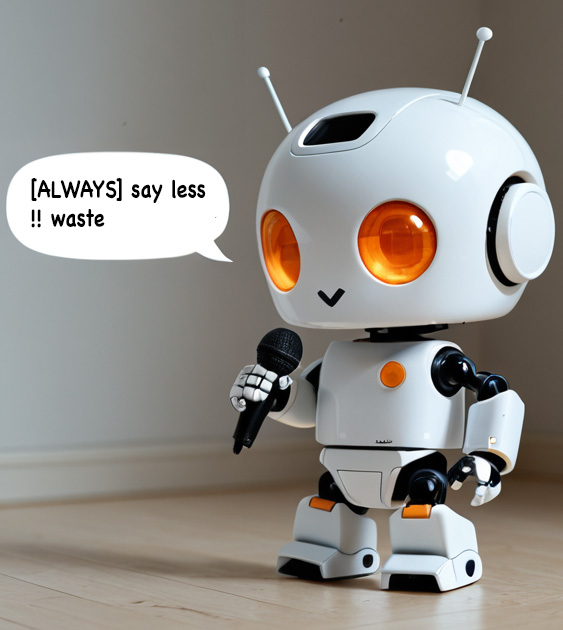

<p align="center">
  
</p>

# BOTSPEAK

**A way for bots to talk to bots.** Your AI doesn't need your prose.

[License: MIT](LICENSE)

---
A skill for AI coding agents. Compresses everything your agent reads — rules, skills, memory pages, and especially handoffs. That thousand-line handoff you paste into a new chat? Cut it 70%. Same information, 70% less context burn before you type your first word.

---

## Before / After 


| Document type                                             | Before      | After (BOTSPEAK) | Reduction |
| --------------------------------------------------------- | ----------- | ---------------- | --------- |
| **Long CLAUDE.md** (the file your AI reads every session) | 985 words   | 433 words        | **56%**   |
| Project philosophy / manifesto rule                       | 1,095 words | 285 words        | **74%**   |
| Context handoff (one session → next)                      | 640 words   | 138 words        | **78%**   |
| Wiki / memory page (Karpathy LLM-wiki style)              | 612 words   | 178 words        | **71%**   |
| Short rule (branch guard)                                 | 262 words   | 154 words        | 41%       |
| Architecture migration plan (code-heavy)                  | 6,356 words | 3,614 words      | 43%       |


Every behavioral constraint, invariant, trigger, and exception preserved. See [examples/](examples/) for the full before/after pairs.

**The biggest unlock:** a long `CLAUDE.md` saves ~550 words *per session*. At 200 sessions a week, that's 110,000 words of input tokens cut. Your agent gets the same instructions with more room left for actual work.

---

## What This Is, in 30 Seconds

Avoid the rot — speak bot. Every rule, skill file, memory page, and handoff your agent re-reads every session was written in prose for you. Burning tokens before you type your first word.

**More signal, less noise.** BOTSPEAK = less rot.

BOTSPEAK is a writing convention for documents whose primary reader is an AI:

- **Symbol contracts** (`!!` = never, `ok` = allowed, `->` = leads to) defined once, used everywhere
- **Aliases** (`@defs E = establishment_id`) declared once, used as `E` everywhere after — kills the #1 token sink in real `CLAUDE.md` files
- **Phase tags** (`[NEW-CHAT]` `[ALWAYS]` `[REFERENCE]`) so agents skip context that doesn't apply to the current session phase
- **XML structure** for long docs because Claude parses XML semantic boundaries more reliably than markdown headings

Still readable. A `/botspeak-translate` skill renders any BOTSPEAK file into clear human prose on demand — you'll rarely need it, but it's there.

---

## Install

### Step 1 — Install the skills (always safe)

```bash
curl -fsSL https://raw.githubusercontent.com/itaki/botspeak/main/install.sh | bash
```

Drops two skills into every AI agent we detect (Claude Code, Cursor, Codex, Gemini CLI, anything in `~/.agents`):

- `/botspeak` — compress a single file or an entire directory of AI-facing docs
- `/botspeak-translate` — render any BOTSPEAK file back to clear human prose for audit

Skills are opt-in: nothing changes until you invoke one.

### Step 2 — Install the always-on rule (manual, by design)

The rule is what tells your AI to write BOTSPEAK *every time* — without you asking. Every IDE handles rules differently and the wrong move would clobber instructions you wrote yourself, so we don't auto-install rules globally. Pick the path for your tool:

| IDE             | What to do                                                                                                                                |
| --------------- | ----------------------------------------------------------------------------------------------------------------------------------------- |
| **Cursor**      | Copy [`rules/botspeak-always-on.mdc`](rules/botspeak-always-on.mdc) into `.cursor/rules/botspeak-always-on.mdc` in your project root. (For globally-active rules, paste the contents into Cursor Settings → Rules → User Rules.) |
| **Claude Code** | Append the contents of [`rules/botspeak-always-on.md`](rules/botspeak-always-on.md) to your project's `CLAUDE.md` (or `~/.claude/CLAUDE.md` for all projects).                |
| **Windsurf**    | Copy [`rules/botspeak-always-on.md`](rules/botspeak-always-on.md) to `.windsurf/rules/botspeak-always-on.md` in your project root.        |
| **Cline**       | Copy [`rules/botspeak-always-on.md`](rules/botspeak-always-on.md) to `.clinerules/botspeak-always-on.md` in your project root.            |
| **Copilot**     | Append [`rules/botspeak-always-on.md`](rules/botspeak-always-on.md) to `.github/copilot-instructions.md`.                                 |
| **Codex / generic** | Copy [`rules/botspeak-always-on.md`](rules/botspeak-always-on.md) into `AGENTS.md` in your project root.                              |
| **Anything else** | Paste [`rules/botspeak-always-on.md`](rules/botspeak-always-on.md) wherever your harness keeps always-on instructions.                  |

Don't see your IDE? Add it — see [CONTRIBUTING.md](CONTRIBUTING.md).

---

## First 60 Seconds After Install

Open your agent. Try one of these:

```
"Compress my CLAUDE.md into BOTSPEAK."
```

```
"Save what we just talked about as a handoff doc for tomorrow."
```
*(With the always-on rule installed, the agent writes the handoff in BOTSPEAK automatically — no special skill needed.)*

```
"Translate this BOTSPEAK rule into plain English so I can review it:
[paste the BOTSPEAK file]"
```

That's it. You'll see a clean BOTSPEAK output, a token-savings summary, and (when running `/botspeak-translate`) a confirmation that nothing important was lost in compression.

**Already have a folder of prose skills you want converted?** Pass the directory to `/botspeak` (e.g. `/botspeak ~/.cursor/skills/`). The skill scans it, shows you total token estimates, asks whether to back up first, and converts the files one by one.

---

## "I Need to Read a BOTSPEAK Document"

There's a skill for that: `/botspeak-translate`. Paste any BOTSPEAK file and it renders clear human prose — all aliases expanded, all symbols converted to words. Run it any time you want to audit a rule or verify nothing drifted in compression.

---

## The Three Things That Do the Work

### 1. Aliases (`@defs`) — the killer feature

Repeated identifiers are the largest single source of token waste in real `CLAUDE.md` files. `establishment_id` appears 47 times. `materialized_view_refresh_concurrently` appears 23 times. Each one costs you 4-8 tokens, every session, forever.

```
@defs
  E   = establishment_id
  S   = establishment.settings.toast_config
  MV  = materialized-view
@end

[ALWAYS] all queries -> filter by E
[ON-TRIGGER] MV stale -> refresh-concurrently
!! never hardcode E && S && any per-establishment value
```

This block alone, used in a 2,000-token file, saves 400+ tokens. Every session.

### 2. Phase Tags

```
[NEW-CHAT]    load at session start; agent may skip after context established
[ALWAYS]      every turn
[ON-TRIGGER]  condition-gated; read only when pattern fires
[REFERENCE]   look-up only; skip during normal session load
[HANDOFF]     cross-session context; new agent reads first turn only
```

A correctly tagged 1,500-token rule file lets a mid-session agent process maybe 600 tokens of it. The rest is context the agent already has, lookup material it doesn't need yet, or first-turn orientation.

### 3. Symbols (two dialects)

**ASCII** (recommended default — every symbol is 1 token guaranteed):

```
->   leads to       !!   never / forbidden
&&   AND            ok   allowed / correct
||   OR             ~~   warn / check first
!=   not-equal      =    defined-as
```

**Symbol** (when human auditing matters more than max tokens):

```
🔴 = !!     ✅ = ok     ⚠️ = ~~     →  = ->     ·  = &&
```

Honest tradeoff: emojis cost 3-4 tokens each but pay for themselves in attention salience. ASCII operators are 1 token each — guaranteed by every modern BPE tokenizer because the code corpus saturated those merges. See `[SPEC.md](SPEC.md)` for the full table.

---

## "Wait, won't this break things?" — FAQ

**Q: Doesn't the AI need prose to understand the rules?**
A: No. LLMs are trained on enormous amounts of structured text — code, JSON, XML, YAML, math notation. They parse symbol contracts at least as well as prose, often better. The "lost in the middle" problem is *worse* for prose than for structured symbols. You can prove this on your own files: BOTSPEAK a rule, then ask your agent to summarize what it says. The summary will match the original prose version.

**Q: What if a new agent on my team can't read it?**
A: Every modern LLM (Claude, GPT, Gemini, Llama, Mistral) handles BOTSPEAK without preamble. The notation is intuitive enough that even older models infer it. If you're worried, include `SPEC.md` in your project; the agent reads it once and you're set.

**Q: Why not just use Caveman?**
A: Different problem. [Caveman](https://github.com/JuliusBrussee/caveman) compresses what the AI *outputs to humans* (chat replies, PR comments, commit messages). BOTSPEAK compresses what the AI *reads from itself* (rules, skills, memory). They compose — install both and you get the full token-efficiency stack.

**Q: Why not just use CRUX-Compress / llm-min.txt / Compresr?**
A: Those are tools that compress existing prose with a custom DSL. BOTSPEAK is a *writing convention* — write in it natively, no compressor agent required. We also ship a round-trip translate skill (CRUX doesn't have a reliable expander), so you can always read your own files. Comparison table below.

**Q: How do I uninstall?**
A: Delete the skill files in your agent's skill directory. No traces left, no migrations needed. The skill is opt-in and stateless.

**Q: Should I rewrite all my existing rules right now?**
A: No. Start with the file your agent reads most often (usually `CLAUDE.md` or your largest always-on rule). Compress that one. Measure the savings. Decide if you want to do more.

**Q: I used my IDE's skill-creation tool and it wrote plain prose. Now what?**
A: Expected. IDE tools (Cursor's `create-skill`, `create-rule`, etc.) don't know about BOTSPEAK — they template prose. Just run `/botspeak` on the file it created (or pass the whole directory: `/botspeak ~/.cursor/skills/`). With the always-on rule installed, anything *new* the AI writes for itself comes out in BOTSPEAK; only files generated by IDE templates need the manual sweep.

---

## Compared to Other Tools


|                          | BOTSPEAK                         | Caveman               | CRUX-Compress         | llm-min.txt      |
| ------------------------ | -------------------------------- | --------------------- | --------------------- | ---------------- |
| **Compresses**           | AI-facing docs (input)           | AI output to humans   | AI rules (input)      | API/library docs |
| **Approach**             | Writing convention               | Output style          | Compressor tool + DSL | Compressor tool  |
| **Aliases**              | ✅ `@defs`                        | —                     | —                     | —                |
| **Phase tags**           | ✅                                | —                     | —                     | —                |
| **Round-trip translate** | ✅ `/botspeak-translate`          | n/a (output is final) | —                     | —                |
| **Frontmatter-safe**     | ✅ (compresses body only)         | n/a                   | partial               | n/a              |
| **Multi-tool support**   | ✅ Claude/Cursor/Codex/Gemini/+25 | ✅ 30+ agents          | Claude/Cursor         | Generic          |
| **Stars (May 2026)**     | new                              | 53.9k                 | ~3                    | ~700             |


BOTSPEAK is the only convention (not tool) for AI-facing document compression with a verified round-trip. We expect it to coexist with Caveman, not compete.

---

## What's in the Box

```
botspeak/
├── README.md                            ← you are here
├── SPEC.md                              ← language spec: symbols, aliases, grammar, pitfalls
├── LICENSE                              ← MIT
├── CHANGELOG.md
├── CONTRIBUTING.md
├── CLAUDE.md, AGENTS.md, GEMINI.md      ← bootstrap files for AI agents working on this repo
├── install.sh                           ← one-line installer (skills only — rules install manually)
├── rules/                               ← always-on rule templates (manual install, see README)
│   ├── botspeak-always-on.md            ← universal markdown (Claude · Windsurf · Cline · Copilot · etc.)
│   └── botspeak-always-on.mdc           ← Cursor format (with alwaysApply frontmatter)
├── .cursor/rules/botspeak.mdc           ← Cursor rule active in this repo (self-hosting)
├── skills/
│   ├── botspeak/SKILL.md                ← compress: file or directory → BOTSPEAK
│   └── botspeak-translate/SKILL.md      ← translate: BOTSPEAK → human prose
├── agents/
│   └── botspeak-translator.md           ← bidirectional agent (for tools that load agent definitions)
└── examples/                            ← six before/after pairs
    ├── 01-short-rule/                   ← branch guard:                   262 → 154 (41%)
    ├── 02-context-handoff/              ← session handoff:                640 → 138 (78%)
    ├── 03-memory-page/                  ← Karpathy-style wiki page:       612 → 178 (71%)
    ├── 04-philosophy-rule/              ← project manifesto:             1095 → 285 (74%)
    ├── 05-aliased-claude-md/            ← long doc + ASCII + aliases:     985 → 433 (56%)
    └── 06-backend-migration/            ← arch migration plan (code-heavy): 6356 → 3614 (43%)
```

---

## On Karpathy's LLM Wiki

Andrej Karpathy's [LLM wiki pattern](https://github.com/Ar9av/obsidian-wiki) is the right idea: compile knowledge once into interconnected markdown pages instead of re-asking the AI the same questions. But those pages are still written in prose. The primary reader of those pages is another AI call, not you.

A BOTSPEAK wiki page carries the same semantic content at 60-75% of the token cost. Your wiki grows; your query cost doesn't. See `[examples/03-memory-page/](examples/03-memory-page/)` for what a wiki page looks like in BOTSPEAK — including the `summary:` frontmatter that makes index-only queries cheap.

---

## On XML for Claude

Claude was trained on enormous quantities of structured text including HTML and XML. [Anthropic's prompt engineering docs](https://docs.claude.com/en/docs/use-xml-tags) recommend XML tags for documents over a few hundred tokens. Internal benchmarks show XML structural boundaries deliver +20-40% accuracy on multi-step reasoning, +30-50% retry consistency, and better long-context retrieval.

BOTSPEAK uses XML for **macro-structure** in long docs (`<context>`, `<rules>`, `<reference>`, `<defs>`) and BOTSPEAK notation for **content** inside those tags. The combination outperforms markdown headings + prose for Claude. See `[examples/05-aliased-claude-md/after.md](examples/05-aliased-claude-md/after.md)` for the canonical example.

---

## Evals

Two experiments in `[evals/](evals/)`:

**[Round-trip fidelity](https://itaki.github.io/botspeak/evals/#round-trip)** — compress a document into BOTSPEAK, translate back to prose, repeat 5 times. Does it drift like a telephone game, or converge and stabilize? (Spoiler: converges at iteration 2, 100% similarity after that.)

**[The Flappy Bird test](https://itaki.github.io/botspeak/evals/game-prompt/demo.html)** — build a complete Flappy Bird game from the original prose prompt, then build it again from the BOTSPEAK-compressed version. Do both games run? Do the physics match? This answers the skeptic question: *does the AI actually do the same thing with the compressed instructions?*

→ **[See all evals](https://itaki.github.io/botspeak/evals/)** — results, tables, and interactive demos.

See `[evals/README.md](evals/README.md)` for methodology and how to run.

---

## Note to Humans Reading This

The README you're reading is in human prose. Intentionally. It's for you.

**Want to see this exact file written as BOTSPEAK?** → `[README-BOTSPEAK-EXAMPLE.md](README-BOTSPEAK-EXAMPLE.md)`

That file is the same document — same sections, same information — compressed into BOTSPEAK notation. Token comparison:


| File                                    | Est. tokens*               |
| --------------------------------------- | -------------------------- |
| `README.md` (this file, human prose)    | ~3,077                     |
| `README-BOTSPEAK-EXAMPLE.md` (BOTSPEAK) | ~2,055                     |
| **Savings**                             | ~~**1,022 tokens (~~33%)** |


*Estimated as characters ÷ 4, a standard approximation for mixed technical/prose content with a BPE tokenizer (tiktoken o200k / cl100k). Note: this README is an outlier — it already contains embedded BOTSPEAK examples and is deliberately lean. A real `CLAUDE.md` with repeated identifiers typically compresses 56–78% (see the Before/After table at the top).

The `SPEC.md`, both `SKILL.md` files, the `.cursor/rules/botspeak.mdc`, the agent definition, and every `after.md` in `examples/` is in BOTSPEAK. Run `/botspeak-translate` on any of them whenever you want to audit one in plain English.

You don't need to read BOTSPEAK. Your agent does.

---

## Notes & Caveats

**Where BOTSPEAK compresses most:** prose-heavy docs — rules, `CLAUDE.md`, memory pages, handoffs, philosophy docs. These are 65–78% compressible because the bulk of their content is verbose explanation.

**Where compression ceilings are lower:** documents with large proportions of already-dense content — Mermaid diagrams, SQL migrations, numeric tables, code blocks, file trees. A migration plan that's 50% diagrams and SQL will compress ~43%, not 74%.

**BOTSPEAK still adds value in dense docs** even when byte savings are modest: `@defs` aliases enforce consistent identifiers, phase tags tell the AI which sections to skip, and `!!` constraint markers make critical invariants impossible to miss.

> **"Won't fewer tokens make my agent worse?"** The opposite. A March 2026 paper found that constraining LLMs to brief responses *improved* accuracy by 26 percentage points on certain benchmarks. Less context noise = better attention. Your agent will likely get *better*, not worse.

**Skip BOTSPEAK on a single doc.** Just ask in plain English: *"write this one in prose"* or *"don't botspeak this file."* The rule has a built-in trigger that hands that document back in human prose without disabling the rule for everything else.

**Use a cheap model for batch jobs.** When you point `/botspeak` at a directory, switch your model to Haiku, GPT-4o-mini, or similar before running. Compression is a mechanical task — thinking models add cost without adding quality.

**Timing expectations.** Measured on Haiku in May 2026: ~2 minutes per 50 KB of plain text. A 200 KB skills folder is ~8 minutes. Thinking models (Sonnet, Opus) run 3-5x slower for the same job.

---

## License

MIT. Free, like your new context window.

---

*Inspired by [Caveman](https://github.com/JuliusBrussee/caveman)'s insight that token efficiency is a design choice. Built for the realization that AI is now a first-class reader of your codebase, and it deserves a format that respects its attention.*