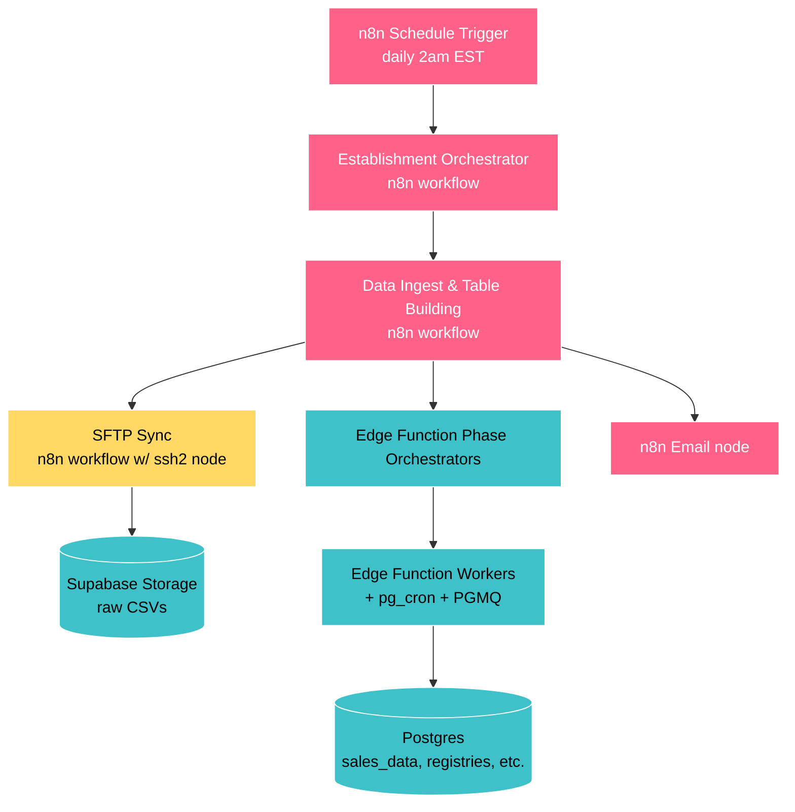
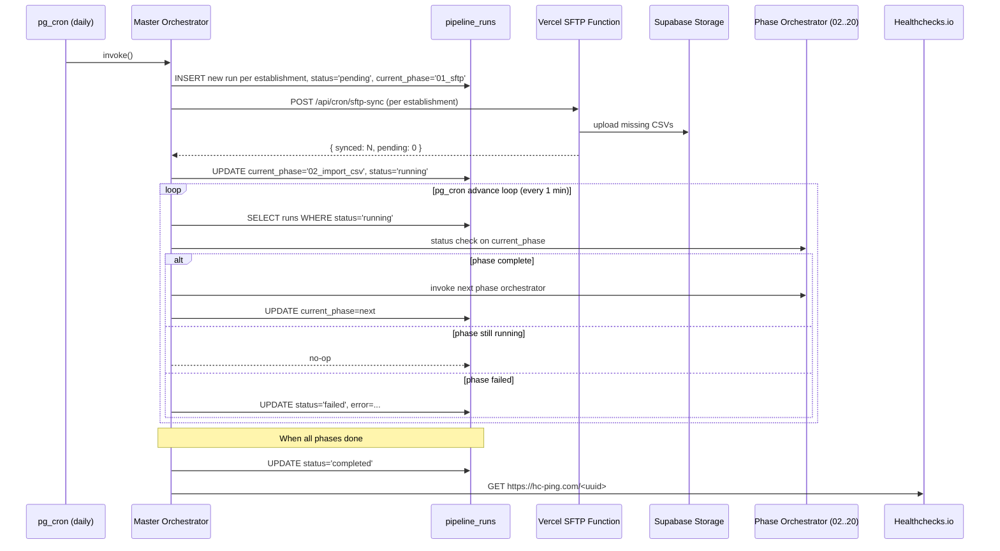

<!-- BOTSPEAK v2.2.0 · compressed by claude-sonnet-4-6 · 2026-05-18 -->

# Backend Migration: n8n → data_acquisition_and_processing

Status: Draft v1 — pending review · Branch: feat/replace-n8n · Author: Architecture · Last updated: 2026-04-21
Target: backend/workflows/DAP/ (to be created) · Decommission: backend/workflows/MRB/ (end of migration)

@defs
 DAP = data_acquisition_and_processing
 MRB = menu_registry_and_backfill
 MO  = master_orchestrator
 PR  = pipeline_runs
 EF  = Edge Function
 DPS = data_processing_status
 HC  = Healthchecks.io
 EID = establishment_id
@end

<context>

[HANDOFF] migration: replace n8n orchestration -> pg_cron + state machine + Vercel SFTP worker
[HANDOFF] ~90% heavy lifting already in Supabase EFs/RPCs/PGMQ; n8n = "fancy UI for calling EFs"
[HANDOFF] new code: backend/workflows/DAP/ (build alongside production) -> decommission MRB/ at end
[HANDOFF] migration = glue replacement, not algorithm replacement

## 1. executive summary

new system components:
- MO EF triggered by pg_cron; drives pipeline through phases
- Vercel cron + serverless function for SFTP ingestion (only step Supabase EFs cannot do)
- existing PGMQ + worker pattern (powers 7 current phases) extended to remaining phases
- independent heartbeat monitor (HC) — system cannot silently fail
- admin dashboard in Next.js frontend: pipeline state · run history · per-phase progress

## 2. why

### trigger

2026-04-13: n8n "Establishment Orchestrator" failed every morning at `Filter Nightly Sync` Code node
error: `Task request timed out after 60 seconds` (n8n Cloud TaskRunner subprocess)
result: pipeline silently produced no data for 1 week · discovered at 2026-04-21 weekly report meeting

### silent failure = architectural defect

```text
n8n Code node fails to start
    ↓
nothing downstream runs
    ↓
nothing reaches the "send error email" node (which is also in n8n)
    ↓
no alert is ever sent
```

system depends on itself to report its own failure -> independent heartbeat required; must fire when expected work DOESN'T happen; hosted outside monitored pipeline

### why move off n8n (immediate bug fixed by upgrading to n8n Cloud 2.17.3)

1. single-maintainer visual editor doesn't compose w/ AI-assisted dev; code-first = diff-able + reviewable + AI-editable
2. n8n Cloud: compounding reliability issues (TaskRunner beta · MCP server gaps · frequent breaking releases)
3. onboarding new establishments imminent -> migrate before multi-tenant, not after
4. n8n actual job = cron trigger + sequence phases + poll "done" + send email -> small surface; reproducible in pg_cron + state machine in ~hundreds of lines
5. admin dashboard (system health · multi-tenant operational view) = something we wanted anyway

### what stays in n8n during migration

nothing · full replacement on feat/replace-n8n -> parity validation in shadow mode -> cutover · n8n runs production until cutover day -> archived + turned off

</context>

<reference>

## 3. current state

### 3.1 architecture (current)

hybrid: n8n (orchestration) + Supabase (heavy lifting)



### 3.2 phases already off n8n

running as EF orchestrators + pg_cron workers + PGMQ queues (n8n only kicks off + polls status):

- 02 — `import_csv_to_database`
- 06 — `backfill_menu_group_ids`
- 09 — `backfill_wine_ids`
- 10 — `backfill_menu_item_ids`
- 11 — `daily_loss_items`
- 12 — `sales_data_aggregated`
- 13 — `order_rounds`

proven Day-Based Worker Pipeline pattern: resumable · observable · fault-tolerant · months in production
[REFERENCE] DAY_BASED_WORKER_PIPELINE.md

### 3.3 remaining n8n surface

| Responsibility | Where | Replacement |
|---|---|---|
| Daily 2am EST trigger | n8n Schedule Trigger | pg_cron (Postgres) |
| Per-establishment fan-out | Filter Nightly Sync Code node + loop | MO EF (SQL query) |
| Phase sequencing | Data Ingest & Table Building workflow nodes | PR state machine + pg_cron advance |
| Poll orchestrators for "done" | n8n loop + httpRequest nodes | advance loop (pg_cron every minute) |
| **SFTP → Supabase Storage** | n8n SFTP nodes | **Vercel cron + serverless SFTP worker** (only piece needing non-Supabase compute) |
| Failure email | n8n Email node | HC alert + dashboard alerts |

### 3.4 documentation map (current system)

[REFERENCE] read in this order:
1. [DAILY_AND_ONBOARDING_OVERVIEW.md](../../backend/workflows/menu_registry_and_backfill/DAILY_AND_ONBOARDING_OVERVIEW.md) — hybrid orchestration · daily vs onboarding modes · error handling
2. [reports/PIPELINE_DIAGRAMS.md](../../backend/workflows/menu_registry_and_backfill/reports/PIPELINE_DIAGRAMS.md) — 6 mermaid diagrams (full pipeline · registry/dedupe · companion tables · settings→phase routing · PGMQ pattern · table lineage)
3. [DAY_BASED_WORKER_PIPELINE.md](../../backend/workflows/menu_registry_and_backfill/DAY_BASED_WORKER_PIPELINE.md) — PGMQ + pg_cron + EF pattern powering most phases (preserved in new system)
4. [README_MENU_REGISTRY_AND_BACKFILL.md](../../backend/workflows/menu_registry_and_backfill/README_MENU_REGISTRY_AND_BACKFILL.md) — index of all 21 phases w/ links + implementation type

[REFERENCE] per-phase entry points:
- Phase 00 (n8n, REPLACING): [README_ORCHESTRATOR.md](../../backend/workflows/menu_registry_and_backfill/00_ESTABLISHMENT_ORCHESTRATOR/README_ORCHESTRATOR.md)
- Phase 01 (n8n, REPLACING): [README_DATA_SYNC.md](../../backend/workflows/menu_registry_and_backfill/01_DATA_SYNC/README_DATA_SYNC.md)
- Phases 02–20: per-phase READMEs in MRB/ (implementation unchanged; only trigger changes)

[REFERENCE] live n8n workflow JSON (will be archived):
- [`00_ESTABLISHMENT_ORCHESTRATOR/code/n8n/01_daily_establishment_orchestrator.json`](../../backend/workflows/menu_registry_and_backfill/00_ESTABLISHMENT_ORCHESTRATOR/code/n8n/01_daily_establishment_orchestrator.json)
- [`01_DATA_SYNC/code/n8n/soviet_sync_v02.json`](../../backend/workflows/menu_registry_and_backfill/01_DATA_SYNC/code/n8n/soviet_sync_v02.json) — SFTP workflow (hardest to replace)
- "Data Ingest and Table Building Pipeline" — in n8n Cloud; export to repo before cutover if not done

[REFERENCE] supplementary:
- [`backend/workflows/WORKFLOWS_OVERVIEW.md`](../../backend/workflows/WORKFLOWS_OVERVIEW.md)
- schema docs under [`shared/database/schema/`](../../shared/database/schema/)
- workspace rule: `multi-tenant-no-hardcoding.mdc`
- workspace rule: `sales-data-immutability.mdc`

### 3.5 documentation gaps (new system must produce)

- master orchestrator design doc (state machine · PR table · advance loop)
- SFTP service deployment doc (Vercel function · env vars · retry/backoff · chunked onboarding)
- heartbeat & alerting doc (HC integration · alert routing · escalation)
- admin dashboard doc (data sources · RLS · components)
- cutover runbook (day-of procedure)
- decommissioning checklist (what to archive · what to delete from n8n Cloud)

## 4. target architecture

### 4.1 component overview

```mermaid
flowchart TB
    classDef vercel fill:#000000,stroke:#fff,color:#fff
    classDef supa fill:#3FC1C9,stroke:#fff,color:#000
    classDef pg fill:#A9DC76,stroke:#fff,color:#000
    classDef ext fill:#AB9DF2,stroke:#fff,color:#000

    PgCronTrigger[pg_cron job<br/>daily 02:00 ET]:::pg
    PgCronAdvance[pg_cron advance loop<br/>every 1 min]:::pg
    PgCronHeartbeat[pg_cron heartbeat ping<br/>after each successful run]:::pg

    Master[Master Orchestrator<br/>Edge Function]:::supa
    Runs[(pipeline_runs<br/>state machine)]:::supa
    PhaseOrch[Existing Phase Orchestrators<br/>02..20]:::supa
    Workers[Existing PGMQ Workers]:::supa
    DB[(Postgres tables)]:::supa

    SftpCron[Vercel cron<br/>daily 02:00 ET]:::vercel
    SftpFn[/api/cron/sftp-sync<br/>Vercel Function<br/>chunked, idempotent]:::vercel
    Storage[(Supabase Storage<br/>raw CSVs)]:::supa

    HC[Healthchecks.io<br/>independent monitor]:::ext
    Dashboard[Next.js Admin Dashboard<br/>/admin/pipeline]:::vercel

    PgCronTrigger --> Master
    Master --> Runs
    PgCronAdvance --> Master
    Master -->|kicks off SFTP| SftpFn
    SftpCron -.fallback trigger.-> SftpFn
    SftpFn -->|raw CSVs| Storage
    Master -->|when SFTP done| PhaseOrch
    PhaseOrch --> Workers
    Workers --> DB
    PgCronHeartbeat --> HC
    HC -.alert if no ping.-> Owner[Owner + on-call]
    Dashboard --> Runs
    Dashboard --> DB
```

### 4.2 daily run sequence



### 4.3 design rationale

- no long-running processes: every component returns in seconds · advancement driven by polling (same model as existing PGMQ pipeline)
- automatic recovery: PR stuck in `running` past expected window -> next advance loop tick picks it up; failed phase retryable w/o rerunning earlier phases
- HC genuinely independent: separate service · alerts when it DOESN'T hear from us by deadline · pipeline cannot silence it by failing
- per-establishment isolation: one establishment's failure doesn't block others (each = own PR row)
- multi-tenant from day one: MO queries establishments · respects `processing_config.nightly_sync` · !! no EID hardcoded

### 4.4 heavy-phase performance patterns (preserved unchanged)

heavy phases (e.g., backfill `menu_item_id` into `sales_data` · wine dedup · `sales_data_aggregated` · `order_rounds`):

fan-out pattern per heavy phase:
1. phase orchestrator fires pg_cron job -> processes ~60 days at a time
2. each chunk pushes per-day jobs into PGMQ
3. multiple workers pull from queue + process days concurrently
4. phase status checker counts completed days vs total; phase = "done" when count matches

MO does not care HOW phase achieves completion; only calls phase orchestrator + polls phase status checker
light phases run inline; heavy phases fan out internally

~~ watch: advance loop polling interval (1 min) must be faster than heavy phase's internal completion granularity · today's polling is fine · if chunks ever shrink below 1 min of work -> increase advance-loop frequency

data point: 10-min weekly backfill (operator, 2026-04-21); nightly = fast · weekly catch-up = minutes · full onboarding = hours — all within existing pattern's tolerance

### 4.5 new components inventory

| Component | Lives in | Replaces |
|---|---|---|
| `pg_cron` daily trigger | `shared/database/migrations/<date>_pipeline_cron.sql` | n8n Schedule Trigger |
| `master_orchestrator` EF | `supabase/functions/master_orchestrator/` | Establishment Orchestrator + Data Ingest workflow (n8n) |
| `pipeline_runs` table | `shared/database/migrations/<date>_pipeline_runs.sql` | n8n execution history |
| `pg_cron` advance loop (every minute) | same migration | n8n "wait + poll" nodes |
| `app/api/cron/sftp-sync/route.ts` | `frontend/app/api/cron/sftp-sync/` | n8n SFTP nodes + Soviet Sync workflow |
| `vercel.json` cron entry | `frontend/vercel.json` | n8n Schedule Trigger for SFTP |
| HC check | external service | (no current equivalent — net new) |
| admin dashboard | `frontend/app/admin/pipeline/` | manual n8n UI inspection |

## 5. SFTP decision

### 5.1 constraint

Soviet delivers daily CSVs over SFTP · Supabase EFs cannot make outbound TCP/SSH (Deno-on-Cloudflare runtime) · confirmed wall when evaluated months ago -> SFTP needs non-Supabase compute

### 5.2 options evaluated

| Option | Cost | Pros | Cons | Verdict |
|---|---|---|---|---|
| **A. Vercel cron + serverless** | $0 added (on Pro) | same project as frontend · deploys on `git push` · cron precision 1 min · Pro = 800s duration w/ Fluid Compute · Node + ssh2-sftp-client native | per-invocation 800s ceiling -> onboarding needs chunking · cold start ~1s | **PRIMARY RECOMMENDATION** |
| B. Small VPS (Fly.io/Railway/Hetzner) | $5/mo | no timeout · persistent SSH · always-on simplifies heartbeat | more to monitor · CI/CD overhead · vendor diversification | backup option |
| C. DreamHost cron | already paying | owned · no new vendor | shared plans don't fit · node availability spotty · low uptime confidence | skip |
| D. Third-party MFT-as-a-service (Files.com etc.) | $100–500+/mo | SLA-backed | wildly overkill · vendor lock-in | skip |
| E. GitHub Actions cron | $0 (private repo minutes) | zero infra · built-in logs | cron has 5–15 min drift (not predictable) · on-demand needs GH API token · logs not in dashboard | skip primary; viable fallback trigger |
| F. AWS Lambda + EventBridge | ~$0 at our scale | mature · reliable | new vendor · new IAM · new deploy pipeline | skip |
| G. Cloudflare Workers | $0 | edge global | `cloudflare:sockets` exists but `ssh2-sftp-client` doesn't support it; custom SFTP impl needed | skip |

### 5.3 recommended: Vercel cron + chunked SFTP worker

Endpoint: `POST /api/cron/sftp-sync`
Inputs: `{ establishment_id: string, mode: "daily" | "onboarding", max_files?: number }`

behavior:
1. read establishment SFTP config from `establishment_settings` (!! no hardcoding — same rule as everywhere)
2. list remote SFTP folders for date range:
   - `daily`: yesterday + last 3 days (catch-up window)
   - `onboarding`: from `data_start_date` to today
3. compare against DPS to find missing files
4. process up to `max_files` (default 100, ~100s of work) per invocation
5. for each file: download -> upload Supabase Storage -> INSERT into DPS with `phase_01_status='completed'`
6. return `{ synced: N, pending: M, has_more: bool }`

daily mode: Vercel cron fires once at 02:00 ET + calls endpoint per establishment; MO also calls as part of pipeline_run start; both produce same idempotent result

onboarding mode: MO calls endpoint in loop w/ `mode=onboarding, max_files=100`; each invocation ~100 files ~100s; returns `has_more`; loop until `has_more=false`; 2800 files = ~28 invocations ~50 min (within Vercel cron per-minute precision)

[REFERENCE] same chunked-worker model as existing PGMQ pipeline; SFTP worker = conceptually "phase 01 worker" on Vercel due to SFTP constraint

### 5.4 SFTP-specific risks

- Soviet SFTP IP allowlisting: confirmed NOT in play (operator, 2026-04-21); Soviet SFTP auth via SSH key only · no source-IP restriction · Vercel-as-SFTP-host confirmed viable
- long onboarding runs: chunking handles; need rate limiting on Vercel function concurrency to avoid hammering Soviet SFTP
- Vercel cold starts: ~1s per cold start; negligible for daily; fine for onboarding
- single-vendor risk: Vercel outage same morning; HC (independent) catches within hours

[REFERENCE] future: Soviet API access (when granted) -> replace entire Vercel SFTP path w/ HTTPS calls -> zero non-Supabase compute; keep SFTP service modular (no SFTP details leak into MO)

## 6. component-by-component migration map

### 6.1 phase mapping

| Old (n8n) | New | Notes |
|---|---|---|
| Schedule Trigger (daily 2am) | `pg_cron` + Vercel cron | two triggers belt-and-suspenders; both invoke idempotent endpoints |
| Establishment Orchestrator | MO EF | queries `establishments` for `nightly_sync=true` · creates PR rows |
| Filter Nightly Sync Code node | SQL `WHERE` in MO | 30-line JS -> 3 lines SQL |
| Soviet Sync (SFTP) | `frontend/app/api/cron/sftp-sync/route.ts` | chunked · idempotent · per-establishment |
| Data Ingest & Table Building | PR state machine + advance loop | phase sequence = data, not workflow nodes |
| Per-phase httpRequest nodes | MO HTTP calls | same target EFs · different caller |
| Per-phase status check loops | advance loop (every 1 min) reads phase status checker | same pattern, runs in pg_cron |
| Failure Email node | HC alert + dashboard alert + email via Resend | multiple independent paths |

### 6.2 phase naming and ordering

old system problem: folder names doubled as sort hints + execution-order contract -> hit `05B` inserting between `05` and `06` (BASIC line-number problem)

fix (same as dbt/Dagster/Airflow):
1. folder names = kebab-case w/ leading number (filesystem sort only; spaced in 10s for insertion; !! never reference by number from code)
2. manifest file at workflow root = source of truth for execution order; references phases by stable string IDs

folder layout for `backend/workflows/DAP/`:

```text
00-establishment-orchestrator/   # block 0  — entry / dispatch
10-data-sync/                    # block 10 — ingestion (Vercel SFTP)
12-data-import/                  #            (CSV → Postgres, PGMQ workers)
20-setup-and-validation/         # block 20 — preparation
30-menu-group-registry/          # block 30 — registry building
32-mark-exceptions/
34-classify-menu-groups/
36-backfill-menu-group-ids/
40-wine-registry/                # block 40 — wine
42-backfill-wine-ids/
50-menu-item-registry/           # block 50 — menu items
52-backfill-menu-item-ids/
60-daily-loss-items/             # block 60 — derived data / aggregations
62-sales-data-aggregated/
64-order-rounds/
66-availability-history/
68-daily-establishment-summary/
70-classify-job-titles/          # block 70 — employee
                                 # block 80 reserved for future expansion
90-heartbeat-and-alerting/       # block 90 — operational concerns
92-admin-dashboard/
```

manifest at workflow root — `backend/workflows/DAP/pipeline.yml`:

```yaml
version: 1
name: data_acquisition_and_processing
phases:
  - id: establishment_orchestrator
    dir: 00-establishment-orchestrator
    type: orchestrator
    next: data_sync

  - id: data_sync
    dir: 10-data-sync
    type: external_worker         # Vercel function
    next: data_import

  - id: data_import
    dir: 12-data-import
    type: pgmq_worker
    next: setup_and_validation

  - id: setup_and_validation
    dir: 20-setup-and-validation
    next: menu_group_registry

  - id: menu_group_registry
    dir: 30-menu-group-registry
    next: mark_exceptions

  # ... and so on. Each phase declares its successor by id.
  # Branching / fan-out can be expressed as `next: [a, b]` later if needed.

  - id: classify_job_titles
    dir: 70-classify-job-titles
    next: null                    # terminal phase
```

how it works:
- MO reads `pipeline.yml` once at startup -> builds directed graph keyed by `id` -> never touches folder names
- add phase: pick unused number in right block -> create folder -> add manifest entry -> point predecessor's `next` to new id (no renames · no broken refs)
- rename folder: change `dir` in manifest (code still refs by `id`)
- renumber folder: change `dir` in manifest
- folder list reads in execution order in any file browser (only purpose of leading number)
- `id` = contract; treat like database column name -> !! never rename without migration

per-phase folder contents:

```text
NN-phase-name/
├── README.md                    # what this phase does, inputs, outputs, error modes
├── code/                        # Edge Function source (or pointer to /supabase/functions/)
└── migrations/                  # any phase-specific migrations (rare; usually shared)
```

### 6.3 database changes

additive migrations only:
- PR table: one row per (establishment, run_date) w/ current phase id · status · timestamps · error
- `pipeline_phase_runs` table (optional): per-phase timing per run for dashboard (defer to v2)
- pg_cron jobs: daily trigger + advance loop

!! no changes to existing tables · !! no migrations against `sales_data` (immutability rule holds)

`pipeline.yml` manifest loaded by MO at function startup + cached for invocation duration · changes take effect next cron tick · !! no DB migration when pipeline shape changes (manifest IS the migration)

## 7. phased rollout

[HANDOFF] migration runs in shadow mode first; n8n stays running entire time

timeline predictions (2026-04-21):
- engineering estimate (assistant): 3–4 weeks across migration + dashboard
- operator prediction: end of day 2026-04-22 (~30 hours from 2026-04-21)
- actual: `<TBD>` (fill in completion timestamp when done)

decision: skip "stop the bleeding" HC-on-existing-n8n step; go straight to new system; if n8n breaks before cutover, manual reruns + next morning discovery = acceptable risk for ~30 hours (operator) or ~3 weeks (assistant)

### Phase A — build new components in shadow (operator: days 1–2 / assistant: weeks 1–3)

goal: stand up DAP/ infrastructure w/ no production impact

- A1. create `backend/workflows/DAP/` skeleton w/ `pipeline.yml` manifest
- A2. migration: PR table
- A3. EF: MO (basic — sequences phases · no error recovery yet)
- A4. Vercel function: `/api/cron/sftp-sync` (daily mode only)
- A5. pg_cron jobs (commented out / disabled initially)
- A6. smoke test: manually trigger MO for one establishment in test schema -> confirm it can drive existing phase orchestrators end-to-end

exit: MO completes full per-establishment run against test data; results match n8n run same date

### Phase B — shadow mode (operator: days 1–2 / assistant: weeks 3–4)

goal: run new pipeline against settled historical dates; prove zero-diff parity w/ n8n output

mechanism: no `shadow_mode` flag · no `*_shadow` schema · existing pipeline already idempotent on rerun · new MO runs against dates n8n processed days ago · if genuinely idempotent -> diff = zero · nonzero diff = bug in MO or latent non-idempotency in existing phase (both bugs worth finding before cutover)

- B1. idempotency audit (precondition): for each phase 12–70, confirm rerunning already-completed date -> no row changes; document non-idempotent phases + fix before proceeding (valuable independent of migration)
- B2. pick settled date (e.g., 7 days ago); snapshot all relevant tables filtered to that date
- B3. manually trigger new MO for `(Fred's Italian Bistro, settled_date)`
- B4. diff post-snapshot vs pre-snapshot; expected: empty diff
- B5. repeat for 3 different settled dates
- B6. final confidence: trigger new MO for one fresh date AFTER n8n fully completed it; diff again; expected: empty

exit: 3+ settled-date reruns = zero diffs + 1 same-day post-n8n rerun = zero diff

why this works: existing system is idempotent (proven by months of operational reruns) -> shadow mode = "did new MO change anything when it shouldn't have?" -> much sharper test than parallel execution + reconciling timestamps

### Phase C — cutover (day after shadow validates)

goal: switch production to new pipeline

- C1. disable n8n Schedule Trigger
- C2. switch new pipeline out of shadow mode (write to production tables)
- C3. watch next 3 daily runs closely
- C4. keep n8n workflow files in repo + n8n Cloud account active 2 weeks as rollback

exit: 3 successful production runs from new pipeline

### Phase D — decommission (after 2 weeks clean production runs)

goal: clean up

- D1. archive n8n workflow JSONs to `_archive/<date>_n8n_workflows/`
- D2. delete workflows in n8n Cloud account
- D3. cancel n8n Cloud subscription (or downgrade to free)
- D4. delete `backend/workflows/MRB/` entirely
- D5. update root `README.md` · `CLAUDE.md` · `QUICK_REFERENCE.md` (remove n8n references)

exit: no n8n references anywhere in repo or production stack

### Phase E — admin dashboard (parallel track)

goal: replace "log into n8n to see what happened" w/ real dashboard

- E1. `/admin/pipeline` route; gated to admin/superadmin/dev roles
- E2. list of recent PR w/ status · current phase · timing
- E3. drill-down per-run: phase-by-phase progress · error details · retry button
- E4. live status of today's run across all establishments
- E5. HC integration (manage check · surface alert state in UI)

useful before cutover (PR populated in shadow mode) -> build in parallel w/ Phase A/B by separate workstream

## 8. risks & mitigations

| Risk | Impact | Likelihood | Mitigation |
|---|---|---|---|
| Shadow-mode diffs reveal logic differences | High | Medium | Phase C catches; don't cut over until 5 clean days |
| Soviet requires fixed source IP for SFTP | High | Low | verify w/ Soviet first (Phase B1); fallback: small VPS |
| Vercel function timeout during onboarding chunk | Medium | Low | chunk size tuned under 800s; default 100 files (~100s) |
| Vercel + Supabase outage same day | High | Very Low | HC independent; alerted within hours |
| pg_cron advance loop falls behind | Medium | Low | loop = 1 min; phase orchestrators async; minimal impact |
| MO bug, all establishments break | High | Medium | start w/ one establishment (Fred's Italian Bistro) 1 week before adding others |
| Decommission MRB/ too early | Medium | Low | don't delete until 2 weeks post-cutover; keep n8n workflow JSONs in `_archive/` permanently |
| New person can't find docs (folder name changed) | Low | Medium | update root README + CLAUDE.md in Phase E5; add forwarding pointer in `_archive/` |

</reference>

<rules>

## 9. shared contracts (single source of truth; both workstreams)

[ALWAYS] changes to this section must be reflected here before either workstream codes against them

### 9.1 workstream ownership

backend chat owns (writes):
- `supabase/functions/master_orchestrator/` — MO EF
- `supabase/functions/<phase_name>/` — new phase orchestrators / status checkers / workers
- `frontend/app/api/cron/sftp-sync/route.ts` — Vercel SFTP worker (lives in `frontend/` for Vercel deploy; server-side backend code)
- `frontend/vercel.json` — cron entries for SFTP worker
- `shared/database/migrations/` — PR table · pg_cron jobs · other migrations
- `backend/workflows/DAP/` — entire new workflow folder incl. phase READMEs + `pipeline.yml`
- HC outbound ping in MO (env-var-gated · ~10 lines)
- "rerun phase" EF endpoint for dashboard retry button (see 9.4)

frontend chat owns (writes):
- `frontend/app/admin/pipeline/` — entire admin dashboard route
- `frontend/components/admin/` — new admin-only UI components
- `frontend/lib/admin/` — new admin-only client utilities
- HC account · check · alert routing (configured at healthchecks.io · not in code)
- UI for surfacing alert state · run drill-downs · retry buttons
- read-side queries against PR (consume only)

neither workstream owns (deferred / out of scope):
- Resend / email routing implementation (HC native email sufficient for v1)
- SMS escalation
- multi-user alert distribution list (defer until post-cutover)
- onboarding workflow UI (separate feature)

### 9.2 pipeline_runs table contract

two ledgers, two granularities:

| Table | Granularity | Owner | Purpose |
|---|---|---|---|
| PR (NEW) | one row per (EID, run_date, mode) | MO writes | orchestration ledger — tracks which phase MO is currently driving |
| DPS (EXISTING, unchanged) | one row per (EID, date) w/ per-phase status columns | individual phase workers update own column | per-phase work ledger — tracks what work each phase completed for that date |

MO reads DPS to decide "is current phase done?" + writes PR to record "we're now on phase X"
dashboard shows both: PR = "what is MO doing right now?" · DPS = "what work has each phase completed for this date?"

backend chat creates PR migration · frontend chat consumes read-only (except retry via 9.4 endpoint)
[ALWAYS] backend chat may add PR columns · !! must not rename or remove columns without coordinated update to this section

```sql
CREATE TABLE pipeline_runs (
  id                  UUID PRIMARY KEY DEFAULT gen_random_uuid(),
  establishment_id    UUID NOT NULL REFERENCES establishments(establishment_id),
  run_date            DATE NOT NULL,                  -- the business date this run is processing
  mode                TEXT NOT NULL,                  -- 'daily' | 'onboarding' | 'manual'
  status              TEXT NOT NULL,                  -- 'pending' | 'running' | 'completed' | 'failed' | 'cancelled'
  current_phase_id    TEXT,                           -- stable phase id from pipeline.yml; NULL when status='pending' or 'completed'
  started_at          TIMESTAMPTZ,
  completed_at        TIMESTAMPTZ,
  error_message       TEXT,
  error_phase_id      TEXT,                           -- which phase failed (if any)
  triggered_by        TEXT NOT NULL,                  -- 'pg_cron' | 'manual' | 'retry' | 'onboarding'
  metadata            JSONB DEFAULT '{}',             -- flexible space for phase-specific state
  created_at          TIMESTAMPTZ NOT NULL DEFAULT NOW(),
  updated_at          TIMESTAMPTZ NOT NULL DEFAULT NOW(),
  UNIQUE (establishment_id, run_date, mode)           -- one run per establishment per date per mode
);

CREATE INDEX idx_pipeline_runs_status ON pipeline_runs(status) WHERE status IN ('pending', 'running');
CREATE INDEX idx_pipeline_runs_recent ON pipeline_runs(created_at DESC);
```

status state machine:

```text
pending → running → completed
              ↓
            failed → (retry creates new run with triggered_by='retry')
              ↓
          cancelled (only via manual override)
```

optional v2: `pipeline_phase_runs` table (per-phase timing per run) — defer until dashboard demands it; backend chat owns migration; frontend chat consumes read-only

### 9.3 environment variables

operator provides HC values from account setup (see §11); backend devs set in Supabase function env; frontend devs set in Vercel project env

| Variable | Provided by | Consumer | Required? | Purpose |
|---|---|---|---|---|
| `HEALTHCHECKS_PING_URL` | operator (from healthchecks.io) | backend (MO emits ping at end of run) | no — no-ops silently if unset | outbound success heartbeat |
| `HEALTHCHECKS_CHECK_UUID` | operator (UUID part of ping URL) | frontend (HeartbeatBanner reads check status) | no — banner shows "not configured" if unset | identifies check for read API calls |
| `HEALTHCHECKS_READ_API_KEY` | operator (read-only API key from healthchecks.io) | frontend (HeartbeatBanner reads check status) | no — banner shows "not configured" if unset | auth for HC read API |
| `MASTER_ORCHESTRATOR_URL` | backend chat (after deploy) | frontend (dashboard retry button proxy) | required once retry button ships | base URL for MO EF (no trailing slash · no `/retry` suffix) |
| `SUPABASE_SERVICE_ROLE_KEY` | already exists | both | already exists | RPC + admin reads |

SFTP credentials per establishment: `establishment_settings.soviet_config.sftp_credentials_key` -> Supabase Vault · !! never env vars · !! no hardcoding rule unchanged

### 9.4 retry endpoint contract

backend chat exposes:

```text
POST /functions/v1/master_orchestrator/retry
Authorization: Bearer <user JWT with admin/superadmin/dev role>
Body: {
  "pipeline_run_id": "uuid",
  "from_phase_id": "<phase_id>" | null    // null = restart from current_phase_id
}
Response: {
  "new_pipeline_run_id": "uuid",
  "status": "pending"
}
```

behavior: creates NEW PR row w/ `triggered_by='retry'` · links to original via `metadata.retried_from=<original_run_id>` · original row left untouched · frontend chat builds button that calls this + updates dashboard

### 9.5 concurrency rules

[ALWAYS] one in-flight PR row per (EID, run_date, mode) at a time; enforced by UNIQUE constraint; MO must check before starting
[ALWAYS] stuck-run timeout: `running` row w/ `started_at` > 6 hours old = abandoned -> advance loop marks `failed` w/ `error_message='timeout'` -> allows new runs
[ALWAYS] cron fires while previous run in progress: MO detects existing `running` row -> log + return no-op (!! does NOT start duplicate)
[ALWAYS] onboarding does not block daily: distinct rows (UNIQUE includes `mode`) -> onboarding for date range + daily for today can run concurrently

### 9.6 shadow-mode strategy

[REFERENCE] see §7 Phase B; no shadow flag · no shadow schema · dashboard shows whatever is in PR

### 9.7 phase IDs are stable

[ALWAYS] `id` field in `pipeline.yml` (e.g., `data_sync`, `menu_group_registry`) = contract; both chats reference phases by id
[ALWAYS] !! renaming an id = breaking change requiring coordinated update · adding new phase = non-breaking

</rules>

<reference>

## 10. open questions & decisions

tracked so developers don't get blocked; all decisions dated 2026-04-21 unless noted

1. ~~Soviet SFTP IP allowlisting~~ **RESOLVED**: no IP allowlisting; SSH key auth only; Vercel-as-SFTP-host confirmed viable
2. ~~Email delivery~~ **DEFERRED**: HC native email sufficient for v1; Resend deferred post-cutover
3. ~~HC plan~~ **RESOLVED — FREE TIER**: 20 checks ceiling far above need; SMS escalation deferred; upgrade only if real need surfaces
4. ~~`pipeline_runs` retention~~ **RESOLVED — KEEP FOREVER**: ~365 rows/year/establishment = trivial; no partitioning/dropping
5. ~~per-establishment runtime budget~~ **RESOLVED — DAILY RUN MUST COMPLETE BY 06:00 ET**: 4 hours after 02:00 trigger; HC grace window; alert fires if run misses 06:00
6. ~~onboarding throttling~~ **RESOLVED — 1 SFTP INVOCATION EVERY 30 SECONDS**: conservative starting point for `mode=onboarding`; tune up if Soviet tolerates it
7. ~~alert distribution list~~ **RESOLVED — OPERATOR-ONLY FOR V1**: single recipient for v1; add second contact post-cutover when known
8. Soviet API access: when granted -> replace entire Vercel SFTP service w/ HTTPS calls -> zero non-Supabase compute; build SFTP service modular (single-responsibility worker; !! no SFTP details leak into MO); informational · not blocking

## 11. HC setup (operator does this once, ~5 minutes)

performed by operator under own account (alert emails -> inbox directly, no forwarding chain)

1. sign up at <https://healthchecks.io/> using `admin@example.com`
2. create check named **"Production data pipeline"**
3. schedule:
   - type: **Simple**
   - period: **24 hours** (pipeline pings once per successful daily run)
   - grace time: **4 hours** (alert fires if no ping by 06:00 ET given 02:00 ET trigger)
4. save check; copy ping URL (`https://hc-ping.com/<uuid>`)
5. Settings -> API Access: create **read-only API key**
6. provide to development chats:
   - `HEALTHCHECKS_PING_URL` = full URL from step 4 -> backend chat (Supabase EF env)
   - `HEALTHCHECKS_CHECK_UUID` = `<uuid>` part only -> frontend chat (Vercel env)
   - `HEALTHCHECKS_READ_API_KEY` = key from step 5 -> frontend chat (Vercel env)

until provided: both backend ping + frontend HeartbeatBanner no-op gracefully (no errors · no broken UI)

post-cutover optional:
- add second email recipient (Open Question 7)
- Hobbyist plan ($5/mo) if SMS escalation needed

## 12. reference links

### documentation that fed this plan

- [DAILY_AND_ONBOARDING_OVERVIEW.md](../../backend/workflows/menu_registry_and_backfill/DAILY_AND_ONBOARDING_OVERVIEW.md)
- [PIPELINE_DIAGRAMS.md](../../backend/workflows/menu_registry_and_backfill/reports/PIPELINE_DIAGRAMS.md)
- [DAY_BASED_WORKER_PIPELINE.md](../../backend/workflows/menu_registry_and_backfill/DAY_BASED_WORKER_PIPELINE.md)
- [README_MENU_REGISTRY_AND_BACKFILL.md](../../backend/workflows/menu_registry_and_backfill/README_MENU_REGISTRY_AND_BACKFILL.md)
- [README_ORCHESTRATOR.md](../../backend/workflows/menu_registry_and_backfill/00_ESTABLISHMENT_ORCHESTRATOR/README_ORCHESTRATOR.md)
- [README_DATA_SYNC.md](../../backend/workflows/menu_registry_and_backfill/01_DATA_SYNC/README_DATA_SYNC.md)
- [`soviet_sync_v02.json`](../../backend/workflows/menu_registry_and_backfill/01_DATA_SYNC/code/n8n/soviet_sync_v02.json)
- [`01_daily_establishment_orchestrator.json`](../../backend/workflows/menu_registry_and_backfill/00_ESTABLISHMENT_ORCHESTRATOR/code/n8n/01_daily_establishment_orchestrator.json)

### external references

- [Vercel Functions duration limits](https://vercel.com/docs/functions/limitations)
- [Vercel cron jobs](https://vercel.com/docs/cron-jobs)
- [Healthchecks.io](https://healthchecks.io/)
- [Supabase pg_cron](https://supabase.com/docs/guides/database/extensions/pg_cron)
- [ssh2-sftp-client](https://www.npmjs.com/package/ssh2-sftp-client)

## Appendix A — why not Inngest/Trigger.dev/Temporal

decision: not worth it for our shape of work

- pipeline = ~15-step linear DAG (not branching workflows w/ complex parallel/conditional logic)
- PGMQ + pg_cron + worker pattern already handles fan-out · retries · resumability for heavy phases
- adding Inngest/Trigger.dev = another vendor · auth model · deploy pipeline · billing line · AI learning surface
- custom state machine in PR = ~200 lines SQL + ~300 lines EF code; maintainable by one person

revisit only if: dozens of branching workflows w/ complex retry semantics · for now: boring + Postgres-native

## Appendix B — why not stay on n8n w/ better monitoring

HC heartbeat (Phase A) closes silent-failure hole regardless of platform; if that were only problem, stop there

reasons to migrate anyway:
1. maintainer ergonomics: code-first > visual editor for AI-assisted dev
2. reliability: n8n Cloud = multi-year track record of breaking releases (TaskRunner = latest)
3. vendor consolidation: removing n8n -> Supabase + Vercel only (2 vendors, not 3)
4. cost: n8n Cloud subscription eliminated
5. fewer things to learn: every contributor (human or AI) needs n8n quirks today; tomorrow = SQL + TypeScript (likely already known)

migration cost (3–4 weeks) recouped within months in maintenance time saved

</reference>
