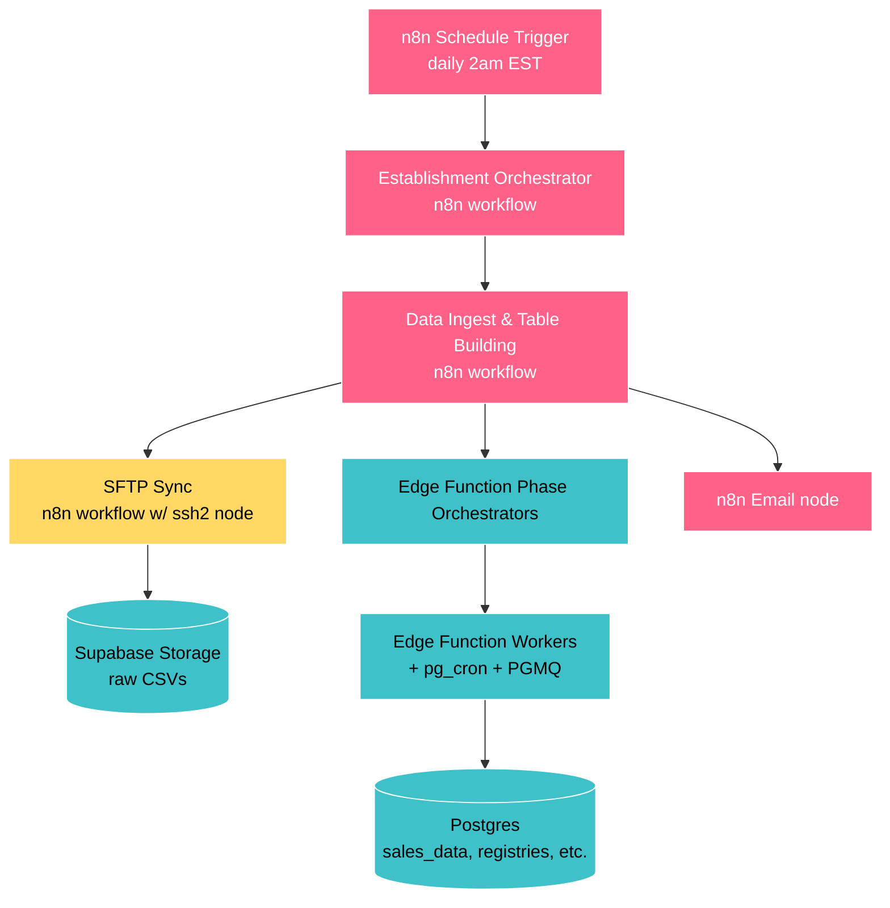
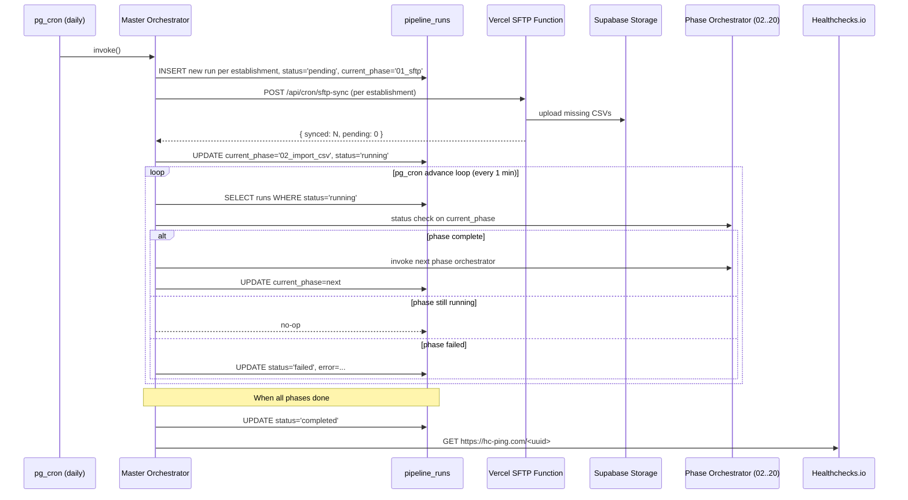

<defs>
MO   = master_orchestrator Edge Function
PR   = pipeline_runs table (NEW)
DPS  = data_processing_status table (EXISTING, unchanged)
HC   = Healthchecks.io
DAP  = backend/workflows/data_acquisition_and_processing/
MRBL = backend/workflows/menu_registry_and_backfill/ (old; decommission at end)
E_ID = establishment_id
</defs>

# Backend Migration: Replace n8n -> DAP

[NEW-CHAT] goal = replace n8n orchestration with pg_cron + MO + Vercel SFTP worker; !! build system, not do the work

## 1. Summary

[ALWAYS] ~90% heavy lifting already in Edge Functions + PGMQ workers; n8n = fancy cron + HTTP caller
replace with: pg_cron trigger -> MO -> existing phase orchestrators -> DPS

new pieces:
- MO (Edge Function) — drives pipeline via PR state machine
- Vercel /api/cron/sftp-sync — only piece outside Supabase (SFTP constraint; see §5)
- HC — !! independent heartbeat; cannot be silenced by pipeline failure
- /admin/pipeline dashboard — replaces manual n8n UI inspection

## 2. Why

[REFERENCE]
root cause: 2026-04-13 n8n TaskRunner timeout killed pipeline silently for 1 week; discovered at weekly meeting 2026-04-21

silent failure path:
```text
Code node fails -> nothing downstream runs -> error email node also in n8n -> no alert ever sent
```

!! architectural defect: system depended on itself to report failure
fix requires: independent heartbeat outside the pipeline it monitors

reasons to migrate (not just add HC):
1. code-first > visual editor for AI-assisted dev; diff-able, reviewable, AI-editable
2. n8n Cloud: TaskRunner beta, breaking releases, MCP gaps
3. onboard new establishments BEFORE they depend on current system
4. n8n actual job shrank to: cron + sequence phases + poll + email -> reproducible in ~600 lines
5. admin dashboard wanted regardless

n8n stays running in production until Phase C cutover; then archived + cancelled

## 3. Current State

### 3.1 Architecture



### 3.2 Already off n8n (proven Day-Based Worker Pipeline pattern)

phases 02, 06, 09, 10, 11, 12, 13 = Edge Function orchestrator + pg_cron workers + PGMQ
n8n only: kick off + poll status

### 3.3 n8n surface still in play

| Responsibility | Current | Replacement |
|---|---|---|
| daily 2am trigger | n8n Schedule Trigger | pg_cron |
| per-E_ID fan-out | "Filter Nightly Sync" Code node | SQL WHERE in MO |
| phase sequencing | workflow nodes | PR state machine |
| poll phase for "done" | n8n loop + httpRequest | advance loop (pg_cron 1min) |
| !! SFTP -> Storage | n8n SFTP nodes | Vercel /api/cron/sftp-sync |
| failure email | n8n Email node | HC alert + dashboard + Resend |

### 3.4 Docs (read order for new dev)

[REFERENCE] must-read first:
1. DAILY_AND_ONBOARDING_OVERVIEW.md — master control; hybrid orchestration; modes; error handling
2. reports/PIPELINE_DIAGRAMS.md — 6 Mermaid diagrams: full pipeline, registry/dedupe, companion tables, settings->phase routing, PGMQ pattern, table lineage
3. DAY_BASED_WORKER_PIPELINE.md — !! PGMQ + pg_cron + Edge Function pattern; PRESERVED unchanged in new system
4. README_MENU_REGISTRY_AND_BACKFILL.md — 21 phases index

per-phase reference (as needed):
- Phase 00: README_ORCHESTRATOR.md (REPLACING)
- Phase 01: README_DATA_SYNC.md (REPLACING)
- Phases 02-20: per-phase READMEs in MRBL; trigger changes only

live n8n JSON (will be archived):
- `00_ESTABLISHMENT_ORCHESTRATOR/code/n8n/01_daily_establishment_orchestrator.json`
- `01_DATA_SYNC/code/n8n/soviet_sync_v02.json` — !! hardest to replace

supplementary (scan if relevant):
- `backend/workflows/WORKFLOWS_OVERVIEW.md`
- `shared/database/schema/`
- rules: `multi-tenant-no-hardcoding.mdc`, `sales-data-immutability.mdc`

### 3.5 Docs new system must produce

[REFERENCE]
- MO design doc (state machine, PR table, advance loop)
- SFTP service deployment doc (Vercel fn, env vars, retry, chunking)
- HC & alerting doc (integration, routing, escalation)
- admin dashboard doc (data sources, RLS, components)
- cutover runbook
- decommission checklist

## 4. Target Architecture

### 4.1 Components

```mermaid
flowchart TB
    classDef vercel fill:#000000,stroke:#fff,color:#fff
    classDef supa fill:#3FC1C9,stroke:#fff,color:#000
    classDef pg fill:#A9DC76,stroke:#fff,color:#000
    classDef ext fill:#AB9DF2,stroke:#fff,color:#000

    PgCronTrigger[pg_cron job<br/>daily 02:00 ET]:::pg
    PgCronAdvance[pg_cron advance loop<br/>every 1 min]:::pg
    PgCronHeartbeat[pg_cron heartbeat ping<br/>after each successful run]:::pg

    Master[Master Orchestrator<br/>Edge Function]:::supa
    Runs[(pipeline_runs<br/>state machine)]:::supa
    PhaseOrch[Existing Phase Orchestrators<br/>02..20]:::supa
    Workers[Existing PGMQ Workers]:::supa
    DB[(Postgres tables)]:::supa

    SftpCron[Vercel cron<br/>daily 02:00 ET]:::vercel
    SftpFn[/api/cron/sftp-sync<br/>Vercel Function<br/>chunked, idempotent]:::vercel
    Storage[(Supabase Storage<br/>raw CSVs)]:::supa

    HC[Healthchecks.io<br/>independent monitor]:::ext
    Dashboard[Next.js Admin Dashboard<br/>/admin/pipeline]:::vercel

    PgCronTrigger --> Master
    Master --> Runs
    PgCronAdvance --> Master
    Master -->|kicks off SFTP| SftpFn
    SftpCron -.fallback trigger.-> SftpFn
    SftpFn -->|raw CSVs| Storage
    Master -->|when SFTP done| PhaseOrch
    PhaseOrch --> Workers
    Workers --> DB
    PgCronHeartbeat --> HC
    HC -.alert if no ping.-> Owner[Owner + on-call]
    Dashboard --> Runs
    Dashboard --> DB
```

### 4.2 Daily run sequence



### 4.3 Design rationale

- no long-running processes; all components return in seconds; advance = polling
- recovery automatic: PR stuck > expected window -> next advance loop tick; failed phase retryable without re-running earlier phases
- !! HC genuinely independent: separate service; alerts on _not_ hearing from us; pipeline failure cannot silence it
- per-E_ID isolation: 1 E_ID failure != block others; each = own PR row
- !! no E_IDs hardcoded; MO queries establishments; respects processing_config.nightly_sync

### 4.4 Heavy-phase fan-out (PRESERVED UNCHANGED)

[REFERENCE]
heavy phases (backfill menu_item_id, wine dedup, sales_data_aggregated, order_rounds):
- phase orchestrator -> pg_cron chunk (~60 days) -> PGMQ per-day jobs -> parallel workers -> status checker counts completed vs expected

MO does not care how phase achieves completion; only calls phase orchestrator + polls status checker
light phases run inline; heavy phases fan out internally

!! if advance loop interval (1min) ever < heavy phase chunk completion time -> increase advance-loop frequency

### 4.5 New components

| Component | Location | Replaces |
|---|---|---|
| pg_cron daily trigger | `shared/database/migrations/<date>_pipeline_cron.sql` | n8n Schedule Trigger |
| MO Edge Function | `supabase/functions/master_orchestrator/` | Establishment Orchestrator + Data Ingest (n8n) |
| PR table | `shared/database/migrations/<date>_pipeline_runs.sql` | n8n execution history |
| pg_cron advance loop (1min) | same migration | n8n wait + poll nodes |
| `/api/cron/sftp-sync/route.ts` | `frontend/app/api/cron/sftp-sync/` | n8n SFTP nodes + Soviet Sync workflow |
| `vercel.json` cron entry | `frontend/vercel.json` | n8n Schedule Trigger for SFTP |
| HC check | external service | (net new) |
| admin dashboard | `frontend/app/admin/pipeline/` | manual n8n UI inspection |

## 5. SFTP Decision

[REFERENCE]
!! constraint: Supabase Edge Functions cannot make outbound TCP/SSH connections (Deno-on-Cloudflare runtime)

| Option | Cost | Verdict |
|---|---|---|
| A. Vercel cron + serverless | $0 added (on Pro) | !! PRIMARY |
| B. small VPS (Fly/Railway/Hetzner) | $5/mo | backup |
| C. DreamHost cron | already paying | skip |
| D. MFT-as-a-service | $100–500+/mo | skip |
| E. GitHub Actions cron | $0 | skip (5–15min scheduling drift) |
| F. AWS Lambda + EventBridge | ~$0 | skip (new vendor) |
| G. Cloudflare Workers | $0 | skip (ssh2-sftp-client incompatible) |

### 5.2 Vercel SFTP worker spec

endpoint: `POST /api/cron/sftp-sync`
inputs: `{ establishment_id: string, mode: "daily" | "onboarding", max_files?: number }`

behavior:
1. read SFTP config from establishment_settings (!! no hardcoding)
2. list remote SFTP folders for date range:
   - `daily`: yesterday + last 3 days
   - `onboarding`: data_start_date -> today
3. compare vs DPS to find missing files
4. process up to max_files (default 100; ~100s of work)
5. each file: download -> Storage -> INSERT DPS `phase_01_status='completed'`
6. return `{ synced: N, pending: M, has_more: bool }`

daily: Vercel cron 02:00 ET + MO both call; idempotent result
onboarding: MO loops with max_files=100 until has_more=false; 2800 files ~28 invocations ~50min

SFTP risks:
- Soviet SFTP IP allowlisting: RESOLVED; SSH key auth only; no source-IP restriction; Vercel viable
- long onboarding: rate-limit concurrency; avoid hammering Soviet SFTP
- cold starts: ~1s; negligible
- Vercel outage: HC independent; alerted within hours

!! future: Soviet API access -> replace entire SFTP path with HTTPS; build SFTP worker single-responsibility so swap is clean (no SFTP details in MO)

## 6. Migration Map

### 6.1 Phase mapping

| Old (n8n) | New | Notes |
|---|---|---|
| Schedule Trigger | pg_cron + Vercel cron | belt-and-suspenders; both idempotent |
| Establishment Orchestrator | MO | SQL WHERE nightly_sync=true; creates PR rows |
| Filter Nightly Sync Code node | SQL WHERE in MO | 30-line JS -> 3-line SQL |
| Soviet Sync (SFTP) | `/api/cron/sftp-sync` (Vercel) | chunked, idempotent, per-E_ID |
| Data Ingest & Table Building | PR state machine + advance loop | phase sequence = data not nodes |
| per-phase httpRequest | MO HTTP calls | same target Edge Functions |
| per-phase status loops | advance loop 1min | same pattern |
| Failure Email | HC + dashboard + Resend | multiple independent paths |

### 6.2 Phase folder naming

[REFERENCE]
defect in old system: `pXX_` prefix = sort hint AND execution contract -> collision at `05B` (BASIC line-number problem)

fix: separate concerns
- folder names: kebab-case + leading number (sort hint ONLY; spaced in 10s; !! never referenced from code)
- `pipeline.yml` at workflow root = execution order source of truth; keyed by stable string id

```text
00-establishment-orchestrator/
10-data-sync/
12-data-import/
20-setup-and-validation/
30-menu-group-registry/
32-mark-exceptions/
34-classify-menu-groups/
36-backfill-menu-group-ids/
40-wine-registry/
42-backfill-wine-ids/
50-menu-item-registry/
52-backfill-menu-item-ids/
60-daily-loss-items/
62-sales-data-aggregated/
64-order-rounds/
66-availability-history/
68-daily-establishment-summary/
70-classify-job-titles/
90-heartbeat-and-alerting/
92-admin-dashboard/
```

`pipeline.yml` example:
```yaml
version: 1
name: data_acquisition_and_processing
phases:
  - id: establishment_orchestrator
    dir: 00-establishment-orchestrator
    type: orchestrator
    next: data_sync
  - id: data_sync
    dir: 10-data-sync
    type: external_worker
    next: data_import
  # ...
  - id: classify_job_titles
    dir: 70-classify-job-titles
    next: null
```

!! phase id = contract; treat like DB column name; renaming = breaking change requiring migration
!! MO reads pipeline.yml at startup; builds directed graph keyed by id; never touches folder names
ok add phase: pick unused number in block; create folder; add manifest entry; point predecessor next
ok rename folder: change `dir` in manifest only

per-phase folder:
```text
NN-phase-name/
├── README.md
├── code/
└── migrations/
```

### 6.3 DB changes

additive only:
- PR table (schema in §9.2)
- `pipeline_phase_runs` (optional; defer to v2)
- pg_cron jobs: daily trigger + advance loop

!! no changes to existing tables; sales-data-immutability rule holds
!! pipeline.yml IS migration for pipeline shape changes; no DB migration needed when phase order changes

## 7. Rollout Phases

n8n stays running until Phase C; shadow work runs against settled historical dates

> timeline: engineering est 3–4 weeks | the operator's bet: end of day 2026-04-22 (~30h from 2026-04-21)
> actual: `<TBD>`
> decision: skip "add HC to existing n8n" step; go straight to new system

### Phase A — Build (shadow; no production impact)

- A1. DAP skeleton + `pipeline.yml`
- A2. migration: PR table
- A3. MO basic (sequence phases; no error recovery yet)
- A4. Vercel `/api/cron/sftp-sync` (daily mode only)
- A5. pg_cron jobs (disabled initially)
- A6. smoke test: manually trigger MO for 1 E_ID in test schema

exit: MO completes full per-E_ID run end-to-end; results match n8n output for same date

### Phase B — Shadow (parity validation)

- B1. !! idempotency audit (precondition): rerun phases 12–70 on completed date -> verify zero row changes; fix any non-idempotent phases before proceeding
- B2. snapshot settled date (7 days ago)
- B3. trigger new MO for (Fred's Italian Bistro, settled_date)
- B4. diff post vs pre -> expected: empty
- B5. repeat for 3 different settled dates
- B6. trigger for 1 fresh date AFTER n8n fully completed it -> diff again

exit: 3+ settled-date reruns = zero diff && 1 same-day post-n8n rerun = zero diff

no shadow flag; no shadow schema; existing system is idempotent by months of operation

### Phase C — Cutover

- C1. disable n8n Schedule Trigger
- C2. new pipeline writes to production tables
- C3. watch next 3 daily runs closely
- C4. keep n8n workflow files + Cloud account active 2 weeks (rollback option)

exit: 3 successful production runs from new pipeline

### Phase D — Decommission (after 2 weeks clean production)

- D1. archive n8n JSONs -> `_archive/<date>_n8n_workflows/`
- D2. delete workflows in n8n Cloud
- D3. cancel n8n Cloud subscription
- D4. !! delete MRBL entirely (all ported to DAP)
- D5. update `README.md`, `CLAUDE.md`, `QUICK_REFERENCE.md`; remove n8n references

exit: zero n8n references anywhere in repo or production stack

### Phase E — Admin Dashboard (parallel track)

- E1. `/admin/pipeline` route (gated: admin || superadmin || dev)
- E2. recent PR list: status, current phase, timing
- E3. drill-down per-run: phase-by-phase progress, error details, retry button
- E4. live status today's run all E_IDs
- E5. HC integration (manage check, surface alert state)

!! build parallel with A/B; PR populated in shadow mode so dashboard useful before cutover

## 8. Risks

| Risk | Impact | Likelihood | Mitigation |
|---|---|---|---|
| Shadow diffs reveal logic differences | High | Medium | !! no cutover until 5 clean days |
| Soviet requires fixed source IP | High | Low | RESOLVED (SSH key; no source-IP); fallback VPS if wrong |
| Vercel fn timeout during onboarding chunk | Medium | Low | chunk tuned <800s; default 100 files ~100s |
| Vercel + Supabase outage same day | High | Very Low | HC independent; alerted within hours |
| pg_cron advance loop falls behind | Medium | Low | 1min interval; phase orchestrators async; minimal impact |
| MO bug breaks all E_IDs | High | Medium | start 1 E_ID (Fred's Italian Bistro) for 1 week before adding others |
| Decommission MRBL too early | Medium | Low | !! wait 2 weeks post-cutover; keep n8n JSONs in _archive/ permanently |
| New person can't find docs | Low | Medium | update README + CLAUDE.md in D5; forwarding pointer in _archive/ |

## 9. Shared Contracts

[ALWAYS] two parallel chats: backend (MO + SFTP + HC ping) || frontend (dashboard + HC config)
!! changes to this section required BEFORE either side codes against them

### 9.1 Workstream ownership

backend chat WRITES:
- `supabase/functions/master_orchestrator/`
- `supabase/functions/<phase_name>/`
- `frontend/app/api/cron/sftp-sync/route.ts`
- `frontend/vercel.json` (cron entries)
- `shared/database/migrations/` (PR table, pg_cron, other migrations)
- `backend/workflows/data_acquisition_and_processing/` (all phase READMEs + pipeline.yml)
- HC outbound ping in MO (env-var-gated; ~10 lines)
- "rerun phase" Edge Function endpoint for retry button (§9.4)

frontend chat WRITES:
- `frontend/app/admin/pipeline/`
- `frontend/components/admin/`
- `frontend/lib/admin/`
- HC account + check + alert routing (healthchecks.io; not in code)
- retry button UI
- read-only queries against PR

neither (deferred):
- Resend email routing
- SMS escalation
- multi-user alert list
- onboarding workflow UI

### 9.2 PR table contract

[ALWAYS] two ledgers:

| Table | Granularity | Writer | Purpose |
|---|---|---|---|
| PR (NEW) | 1 row per (E_ID, run_date, mode) | MO | orchestration ledger: which phase is MO currently driving |
| DPS (EXISTING, unchanged) | 1 row per (E_ID, date) with per-phase status cols | phase workers | work ledger: what each phase completed for that date |

MO reads DPS -> "is phase done?" && writes PR -> "now on phase X"
dashboard shows both: PR = what orchestrator doing now; DPS = what work each phase completed

!! backend chat may ADD columns to PR; !! must NOT rename or remove without coordinated update to §9

```sql
CREATE TABLE pipeline_runs (
  id                  UUID PRIMARY KEY DEFAULT gen_random_uuid(),
  establishment_id    UUID NOT NULL REFERENCES establishments(establishment_id),
  run_date            DATE NOT NULL,
  mode                TEXT NOT NULL,           -- 'daily' | 'onboarding' | 'manual'
  status              TEXT NOT NULL,           -- 'pending' | 'running' | 'completed' | 'failed' | 'cancelled'
  current_phase_id    TEXT,                    -- stable phase id from pipeline.yml; NULL when pending || completed
  started_at          TIMESTAMPTZ,
  completed_at        TIMESTAMPTZ,
  error_message       TEXT,
  error_phase_id      TEXT,
  triggered_by        TEXT NOT NULL,           -- 'pg_cron' | 'manual' | 'retry' | 'onboarding'
  metadata            JSONB DEFAULT '{}',
  created_at          TIMESTAMPTZ NOT NULL DEFAULT NOW(),
  updated_at          TIMESTAMPTZ NOT NULL DEFAULT NOW(),
  UNIQUE (establishment_id, run_date, mode)
);

CREATE INDEX idx_pipeline_runs_status ON pipeline_runs(status) WHERE status IN ('pending', 'running');
CREATE INDEX idx_pipeline_runs_recent ON pipeline_runs(created_at DESC);
```

status state machine:
```text
pending -> running -> completed
               |
            failed -> (retry creates NEW row; triggered_by='retry')
               |
           cancelled (manual only)
```

v2 optional: `pipeline_phase_runs` (per-phase timing per run); defer until dashboard demands; backend owns migration; frontend consumes read-only

### 9.3 Environment variables

[REFERENCE]
!! SFTP creds: establishment_settings.soviet_config.sftp_credentials_key -> Supabase Vault; never env vars

| Variable | Source | Consumer | Required? | Purpose |
|---|---|---|---|---|
| `HEALTHCHECKS_PING_URL` | the operator (from HC) | backend MO | no; no-ops if unset | outbound success heartbeat |
| `HEALTHCHECKS_CHECK_UUID` | the operator | frontend HeartbeatBanner | no; shows "not configured" | identify check for read API |
| `HEALTHCHECKS_READ_API_KEY` | the operator (read-only key) | frontend HeartbeatBanner | no | auth HC read API |
| `MASTER_ORCHESTRATOR_URL` | backend chat (post-deploy) | frontend retry button proxy | required once retry ships | MO base URL (no trailing slash, no /retry suffix) |
| `SUPABASE_SERVICE_ROLE_KEY` | already exists | both | already exists | RPC + admin reads |

### 9.4 Retry endpoint contract

backend exposes:
```text
POST /functions/v1/master_orchestrator/retry
Authorization: Bearer <user JWT; role = admin || superadmin || dev>
Body: {
  "pipeline_run_id": "uuid",
  "from_phase_id": "<phase_id>" | null    // null = restart from current_phase_id
}
Response: {
  "new_pipeline_run_id": "uuid",
  "status": "pending"
}
```

behavior: creates NEW PR row (triggered_by='retry'); metadata.retried_from = <original_run_id>; original row untouched
frontend: button calls this; updates dashboard

### 9.5 Concurrency rules

[ALWAYS]
- !! 1 in-flight PR row per (E_ID, run_date, mode); enforced by UNIQUE constraint; MO checks before starting
- stuck-run timeout: `running` row with started_at > 6h = abandoned; advance loop marks `failed` (error_message='timeout'); new runs allowed
- cron fires while run in progress: MO detects existing `running` row -> log -> return no-op; !! no duplicate
- onboarding != block daily: mode in UNIQUE key; onboarding + daily run concurrently

### 9.6 Shadow mode

no flag; no shadow schema; run new MO against settled past dates; prove zero-diff
!! frontend: do NOT gate dashboard behavior on shadow flag; show whatever is in PR

### 9.7 Phase IDs

[ALWAYS] phase id = contract; both chats reference phases by id
!! renaming id = breaking change; coordinated update required
ok adding new phase = non-breaking

## 10. Open Questions / Decisions

[REFERENCE]
1. RESOLVED: Soviet SFTP IP allowlisting — SSH key only; no source-IP restriction; Vercel confirmed viable
2. DEFERRED: email delivery — HC native email sufficient v1; Resend post-cutover
3. RESOLVED: HC plan — FREE TIER; 20 checks >> need; SMS deferred; upgrade only if needed
4. RESOLVED: PR retention — KEEP FOREVER; ~365 rows/yr/E_ID = trivial; no partitioning
5. RESOLVED: per-E_ID runtime budget — daily run complete by 06:00 ET; HC grace = 4h after 02:00 trigger
6. RESOLVED: onboarding throttle — 1 SFTP invocation / 30s starting point; tune up if Soviet tolerates
7. RESOLVED: alert list v1 — the operator only; add second contact post-cutover
8. INFORMATIONAL: Soviet API access — when granted, Vercel SFTP -> HTTPS calls; zero non-Supabase compute; !! build SFTP worker single-responsibility for clean swap

## 11. HC Setup (operator; one-time ~5min)

[REFERENCE]
1. sign up: https://healthchecks.io/
2. create check "Production data pipeline"
3. schedule: type=Simple; period=24h; grace=4h (alert if no ping by 06:00 ET given 02:00 trigger)
4. save; copy ping URL (https://hc-ping.com/<uuid>)
5. Settings -> API Access -> create read-only API key
6. provide to dev chats:
   - `HEALTHCHECKS_PING_URL` = full URL -> backend chat (Supabase Edge Function env)
   - `HEALTHCHECKS_CHECK_UUID` = <uuid> part -> frontend chat (Vercel env)
   - `HEALTHCHECKS_READ_API_KEY` = key from step 5 -> frontend chat (Vercel env)

!! until provided: backend ping + frontend HeartbeatBanner no-op gracefully; no errors; no broken UI

post-cutover optional: add 2nd email recipient; Hobbyist plan ($5/mo) for SMS if needed

## 12. Reference Links

[REFERENCE]
### Docs fed this plan
- [DAILY_AND_ONBOARDING_OVERVIEW.md](../../backend/workflows/menu_registry_and_backfill/DAILY_AND_ONBOARDING_OVERVIEW.md)
- [PIPELINE_DIAGRAMS.md](../../backend/workflows/menu_registry_and_backfill/reports/PIPELINE_DIAGRAMS.md)
- [DAY_BASED_WORKER_PIPELINE.md](../../backend/workflows/menu_registry_and_backfill/DAY_BASED_WORKER_PIPELINE.md)
- [README_MENU_REGISTRY_AND_BACKFILL.md](../../backend/workflows/menu_registry_and_backfill/README_MENU_REGISTRY_AND_BACKFILL.md)
- [README_ORCHESTRATOR.md](../../backend/workflows/menu_registry_and_backfill/00_ESTABLISHMENT_ORCHESTRATOR/README_ORCHESTRATOR.md)
- [README_DATA_SYNC.md](../../backend/workflows/menu_registry_and_backfill/01_DATA_SYNC/README_DATA_SYNC.md)
- [`soviet_sync_v02.json`](../../backend/workflows/menu_registry_and_backfill/01_DATA_SYNC/code/n8n/soviet_sync_v02.json)
- [`01_daily_establishment_orchestrator.json`](../../backend/workflows/menu_registry_and_backfill/00_ESTABLISHMENT_ORCHESTRATOR/code/n8n/01_daily_establishment_orchestrator.json)

### External
- https://vercel.com/docs/functions/limitations
- https://vercel.com/docs/cron-jobs
- https://healthchecks.io/
- https://supabase.com/docs/guides/database/extensions/pg_cron
- https://www.npmjs.com/package/ssh2-sftp-client

## Appendix A — Why not Inngest / Trigger.dev / Temporal?

[REFERENCE]
pipeline = 15-step linear DAG; not complex branching
PGMQ + pg_cron already handles fan-out, retries, resumability for heavy phases
adding code-first workflow engine = new vendor + auth model + deploy pipeline + billing + AI learning surface
custom PR state machine = ~200 SQL + ~300 Edge Function lines; maintainable by 1 person
!! revisit only if dozens of branching workflows with complex retry semantics emerge

## Appendix B — Why not stay on n8n with better monitoring?

[REFERENCE]
HC closes silent-failure hole regardless of platform; if that were only problem, stop there

reasons to migrate anyway:
1. code-first > visual editor for AI-assisted dev
2. n8n Cloud: multi-year track record of breaking releases
3. vendor consolidation: remove n8n -> Supabase + Vercel only (2 vendors not 3)
4. cost: n8n Cloud subscription gone
5. contributors know SQL + TypeScript already; n8n quirks = extra cognitive load for humans + AI

migration cost (3–4 weeks) recouped in months from maintenance savings
