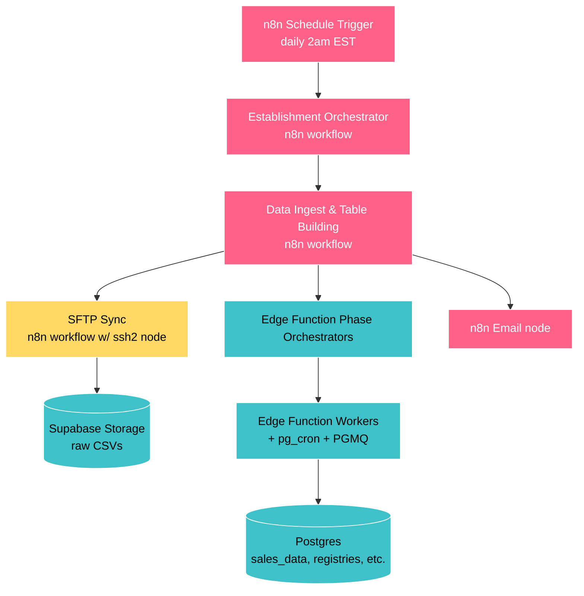
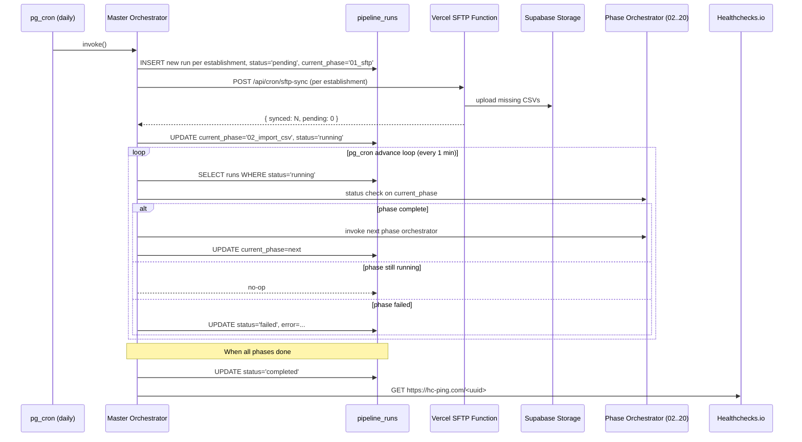

# Backend Migration Plan: Replace n8n with `data_acquisition_and_processing`

**Status**: Draft v1 — pending review
**Branch**: `feat/replace-n8n`
**Author**: Architecture
**Last updated**: 2026-04-21
**Target workflow folder**: `backend/workflows/data_acquisition_and_processing/` (to be created)
**Decommissioning**: `backend/workflows/menu_registry_and_backfill/` (entire folder, at end of migration)

---

## 1. Executive Summary

We are replacing n8n as our orchestration platform for the daily data acquisition and processing pipeline. The new system is composed of:

- A **master orchestrator Edge Function** triggered by `pg_cron` that drives the pipeline through phases.
- A **Vercel cron + serverless function** that handles SFTP ingestion (the only step Supabase Edge Functions cannot do).
- The **existing PGMQ + worker pattern** (already powering 7 of the current phases) extended to the remaining phases.
- An **independent heartbeat monitor** (Healthchecks.io) so the system cannot silently fail.
- An **admin dashboard** in the Next.js frontend exposing pipeline state, run history, and per-phase progress.

The migration is mostly **glue replacement, not algorithm replacement**. ~90% of the heavy lifting already runs in Supabase Edge Functions, RPCs, and PGMQ workers. n8n is largely a "fancy UI for calling Edge Functions" and we're replacing it with `pg_cron` + a state machine.

The new code lives in a new workflow folder (`backend/workflows/data_acquisition_and_processing/`) so we can build alongside the running system and decommission `menu_registry_and_backfill/` cleanly at the end.

---

## 2. Why We're Doing This

### The trigger event

On approximately **2026-04-13**, the n8n "Establishment Orchestrator" workflow began failing every morning at the very first node — `Filter Nightly Sync`, a trivial JavaScript Code node — with `Task request timed out after 60 seconds` from n8n Cloud's TaskRunner subprocess. **The pipeline silently produced no data for an entire week.** A weekly report meeting on 2026-04-21 surfaced the failure — there was no operational data to discuss.

### Why "silent" is the architectural problem

The error path in our current setup looks like this:

```text
n8n Code node fails to start
    ↓
nothing downstream runs
    ↓
nothing reaches the "send error email" node (which is also in n8n)
    ↓
no alert is ever sent
```

The system depends on itself to report its own failure. This is the only architectural defect that justifies action regardless of the n8n decision — we need an **independent heartbeat** that fires when expected work _doesn't_ happen, hosted outside the pipeline it's monitoring.

### Why move off n8n

Even with the immediate Code-node bug fixed (resolved by upgrading to n8n Cloud 2.17.3), several long-standing concerns make this the right time to migrate:

1. **One person maintains all workflows** (the operator). The visual editor doesn't compose well with AI-assisted development; copy-paste from Claude/Cursor into the n8n UI is friction-laden. Code-first workflows would be diff-able, reviewable, and AI-editable.
2. **n8n Cloud has had compounding reliability issues** (TaskRunner beta, MCP server gaps, frequent breaking releases).
3. **We're about to onboard new establishments.** Better to migrate _before_ we have multiple tenants depending on the current system, not after.
4. **Most of n8n's job is calling Edge Functions.** Looking at the existing workflows, n8n's actual responsibility has shrunk to: cron trigger, sequence phases, poll for "done", send an email. That's a very small surface — reproducible in `pg_cron` + a state machine in a few hundred lines.
5. **The dashboard we want to build for this is something we wanted anyway** (system health, multi-tenant operational view).

### What stays in n8n during migration

Nothing. The plan is full replacement on the new branch, parity validation in shadow mode, then cutover. n8n stays running in production until cutover day, then it gets archived and turned off.

---

## 3. Current State

### 3.1 Architecture summary

The current pipeline is a hybrid of n8n (orchestration) and Supabase (heavy lifting):



### 3.2 What's already off n8n

Phases that already run as **Edge Function orchestrators + pg_cron-driven workers + PGMQ queues**, with n8n only kicking them off and polling status:

- 02 — `import_csv_to_database`
- 06 — `backfill_menu_group_ids`
- 09 — `backfill_wine_ids`
- 10 — `backfill_menu_item_ids`
- 11 — `daily_loss_items`
- 12 — `sales_data_aggregated`
- 13 — `order_rounds`

This is the proven [Day-Based Worker Pipeline pattern](../../backend/workflows/menu_registry_and_backfill/DAY_BASED_WORKER_PIPELINE.md). It's resumable, observable, fault-tolerant, and we've operated it in production for months.

### 3.3 What's still in n8n

The actual remaining n8n surface is small:

| Responsibility | Where it lives | What replaces it |
|---|---|---|
| Daily 2am EST trigger | n8n Schedule Trigger | `pg_cron` (Postgres) |
| Per-establishment fan-out | "Filter Nightly Sync" Code node + loop | Master orchestrator Edge Function (SQL query) |
| Phase sequencing | "Data Ingest & Table Building" workflow nodes | State machine in `pipeline_runs` table, advanced by pg_cron |
| Polling phase orchestrators for "done" | n8n loop + httpRequest nodes | `pipeline_runs` advance loop (pg_cron every minute) |
| **SFTP → Supabase Storage** | n8n SFTP nodes | **Vercel cron + serverless SFTP worker** (only piece needing non-Supabase compute) |
| Failure email | n8n Email node | Heartbeat monitor + dashboard alerts |

### 3.4 Documentation map (current system)

The most important docs from the existing `menu_registry_and_backfill/` folder, organized by purpose. The backend developer building the new system should read in this order:

#### Must-read core (read first)

1. **[DAILY_AND_ONBOARDING_OVERVIEW.md](../../backend/workflows/menu_registry_and_backfill/DAILY_AND_ONBOARDING_OVERVIEW.md)** — Master control document explaining hybrid orchestration, daily vs onboarding modes, and error handling.
2. **[reports/PIPELINE_DIAGRAMS.md](../../backend/workflows/menu_registry_and_backfill/reports/PIPELINE_DIAGRAMS.md)** — Six Mermaid diagrams covering the full pipeline, registry/dedupe flow, companion tables, settings → phase routing, the PGMQ orchestrator/worker pattern, and table lineage.
3. **[DAY_BASED_WORKER_PIPELINE.md](../../backend/workflows/menu_registry_and_backfill/DAY_BASED_WORKER_PIPELINE.md)** — The PGMQ + pg_cron + Edge Function pattern that powers most existing phases. **This pattern is preserved in the new system.**
4. **[README_MENU_REGISTRY_AND_BACKFILL.md](../../backend/workflows/menu_registry_and_backfill/README_MENU_REGISTRY_AND_BACKFILL.md)** — Complete index of all 21 phases with links and implementation type.

#### Per-phase entry points (reference as needed)

- **Phase 00 — Establishment Orchestrator (n8n, REPLACING)**: [README_ORCHESTRATOR.md](../../backend/workflows/menu_registry_and_backfill/00_ESTABLISHMENT_ORCHESTRATOR/README_ORCHESTRATOR.md)
- **Phase 01 — Data Sync via SFTP (n8n, REPLACING)**: [README_DATA_SYNC.md](../../backend/workflows/menu_registry_and_backfill/01_DATA_SYNC/README_DATA_SYNC.md)
- Phases 02–20 — see the per-phase READMEs in [`menu_registry_and_backfill/`](../../backend/workflows/menu_registry_and_backfill/). All keep their current implementation; only how they're triggered changes.

#### Live n8n workflow JSON (reference, will be archived)

These are the actual deployed n8n workflows. The new system must produce equivalent behavior:

- [`00_ESTABLISHMENT_ORCHESTRATOR/code/n8n/01_daily_establishment_orchestrator.json`](../../backend/workflows/menu_registry_and_backfill/00_ESTABLISHMENT_ORCHESTRATOR/code/n8n/01_daily_establishment_orchestrator.json)
- [`01_DATA_SYNC/code/n8n/soviet_sync_v02.json`](../../backend/workflows/menu_registry_and_backfill/01_DATA_SYNC/code/n8n/soviet_sync_v02.json) — **the SFTP workflow that's hardest to replace**
- "Data Ingest and Table Building Pipeline" — main per-establishment workflow that calls all phase orchestrators in sequence (lives in n8n Cloud; export to repo before cutover if not already)

#### Supplementary (scan only if relevant)

- [`backend/workflows/WORKFLOWS_OVERVIEW.md`](../../backend/workflows/WORKFLOWS_OVERVIEW.md) — top-level index across all workflows
- Schema docs under [`shared/database/schema/`](../../shared/database/schema/)
- Multi-tenant rules (already enforced everywhere): see workspace rule `multi-tenant-no-hardcoding.mdc`
- Sales data immutability rule: see workspace rule `sales-data-immutability.mdc`

### 3.5 Documentation gaps the new system must fill

When the new workflow folder `data_acquisition_and_processing/` is built, each phase gets its own README. The migration plan also produces:

- **Master orchestrator design doc** (state machine, `pipeline_runs` table, advance loop)
- **SFTP service deployment doc** (Vercel function, env vars, retry/backoff, chunked execution for onboarding)
- **Heartbeat & alerting doc** (Healthchecks.io integration, alert routing, escalation)
- **Admin dashboard doc** (data sources, RLS, components)
- **Cutover runbook** (the actual day-of-cutover procedure)
- **Decommissioning checklist** (what to archive, what to delete from n8n Cloud)

---

## 4. Target Architecture

### 4.1 Component overview

```mermaid
flowchart TB
    classDef vercel fill:#000000,stroke:#fff,color:#fff
    classDef supa fill:#3FC1C9,stroke:#fff,color:#000
    classDef pg fill:#A9DC76,stroke:#fff,color:#000
    classDef ext fill:#AB9DF2,stroke:#fff,color:#000

    PgCronTrigger[pg_cron job<br/>daily 02:00 ET]:::pg
    PgCronAdvance[pg_cron advance loop<br/>every 1 min]:::pg
    PgCronHeartbeat[pg_cron heartbeat ping<br/>after each successful run]:::pg

    Master[Master Orchestrator<br/>Edge Function]:::supa
    Runs[(pipeline_runs<br/>state machine)]:::supa
    PhaseOrch[Existing Phase Orchestrators<br/>02..20]:::supa
    Workers[Existing PGMQ Workers]:::supa
    DB[(Postgres tables)]:::supa

    SftpCron[Vercel cron<br/>daily 02:00 ET]:::vercel
    SftpFn[/api/cron/sftp-sync<br/>Vercel Function<br/>chunked, idempotent]:::vercel
    Storage[(Supabase Storage<br/>raw CSVs)]:::supa

    HC[Healthchecks.io<br/>independent monitor]:::ext
    Dashboard[Next.js Admin Dashboard<br/>/admin/pipeline]:::vercel

    PgCronTrigger --> Master
    Master --> Runs
    PgCronAdvance --> Master
    Master -->|kicks off SFTP| SftpFn
    SftpCron -.fallback trigger.-> SftpFn
    SftpFn -->|raw CSVs| Storage
    Master -->|when SFTP done| PhaseOrch
    PhaseOrch --> Workers
    Workers --> DB
    PgCronHeartbeat --> HC
    HC -.alert if no ping.-> Owner[Owner + on-call]
    Dashboard --> Runs
    Dashboard --> DB
```

### 4.2 Daily run sequence



### 4.3 Why this design

- **No long-running processes anywhere.** Every component returns within seconds; advancement is driven by polling. This is the same model that makes the existing PGMQ pipeline robust.
- **Recovery is automatic.** A pipeline_run stuck in `running` past its expected window is picked up by the next advance loop tick. A failed phase can be retried without rerunning earlier phases.
- **Heartbeat is genuinely independent.** Healthchecks.io is a separate service whose only job is to alert when it _doesn't_ hear from us by a deadline. The pipeline cannot silence it by failing.
- **Per-establishment isolation.** One establishment's failure doesn't block others — each is its own row in `pipeline_runs`.
- **Multi-tenant from day one.** The orchestrator queries establishments and respects `processing_config.nightly_sync` exactly like the n8n version did. No establishment IDs hardcoded.

### 4.4 Preserving heavy-phase performance patterns

Some phases are computationally heavy, especially during onboarding. Examples:

- **Backfilling `menu_item_id` into `sales_data`** — for an established restaurant with 4 years of history this is millions of rows. Onboarding a new establishment with 1400+ days of historical data is an even bigger lift.
- **Wine deduplication and `menu_item_registry` building** — fuzzy matching across a long history is non-trivial.
- **`sales_data_aggregated` and `order_rounds`** — daily aggregation across the full date range.

The existing system already solves this with a **fan-out pattern inside each heavy phase**:

1. Phase orchestrator fires a `pg_cron` job that processes ~60 days at a time.
2. Each chunk pushes per-day jobs into PGMQ.
3. Multiple workers pull jobs off the queue in parallel and process days concurrently.
4. The phase status checker counts completed days vs total expected; phase is "done" when count matches.

**This pattern is preserved unchanged in the new system.** The master orchestrator does not care _how_ a phase achieves completion; it only calls the phase orchestrator and polls the phase status checker. Heavy phases continue to fan out internally; light phases run inline. The 10-minute weekly backfill (the operator, 2026-04-21) is a real data point: nightly runs are fast, weekly catch-up takes minutes, full onboarding takes hours — all within the existing pattern's tolerance.

The only thing to watch on the new system: when the master orchestrator polls a heavy phase, the polling interval (1 min via `pg_cron` advance loop) should be _faster_ than the heavy phase's internal completion granularity. Today's polling is fine. If we ever shrink chunks below 1 min of work, increase advance-loop frequency.

### 4.5 New components inventory

| Component | Lives in | Replaces |
|---|---|---|
| `pg_cron` daily trigger | `shared/database/migrations/<date>_pipeline_cron.sql` | n8n Schedule Trigger |
| `master_orchestrator` Edge Function | `supabase/functions/master_orchestrator/` | Establishment Orchestrator + Data Ingest workflow (n8n) |
| `pipeline_runs` table | `shared/database/migrations/<date>_pipeline_runs.sql` | n8n execution history |
| `pg_cron` advance loop (every minute) | same migration | n8n's "wait + poll" nodes |
| `app/api/cron/sftp-sync/route.ts` | `frontend/app/api/cron/sftp-sync/` | n8n SFTP nodes + Soviet Sync workflow |
| `vercel.json` cron entry | `frontend/vercel.json` | n8n Schedule Trigger for SFTP |
| Healthchecks.io check | external service | (no current equivalent — net new) |
| Admin dashboard | `frontend/app/admin/pipeline/` | Manual n8n UI inspection |

---

## 5. The SFTP Decision

### 5.1 Constraint

Soviet delivers daily CSVs over SFTP. **Supabase Edge Functions cannot make outbound TCP/SSH connections** — they're Deno-on-Cloudflare-style runtimes, not full Node servers. We hit this exact wall when we evaluated migrating months ago. So the SFTP step needs compute that lives outside Supabase.

### 5.2 Options evaluated

| Option | Cost | Pros | Cons | Verdict |
|---|---|---|---|---|
| **A. Vercel cron + serverless function** | $0 added (already on Pro) | Same project as frontend; deploys on `git push`; cron precision down to 1 min; Pro plan = 800s function duration with Fluid Compute; Node + ssh2-sftp-client work natively | Per-invocation 800s ceiling means onboarding (1400+ days × 2 files) needs chunking; cold start adds ~1s | **PRIMARY RECOMMENDATION** |
| B. Small VPS (Fly.io / Railway / Hetzner) | $5/mo | No timeout; persistent SSH connection; always-on simplifies heartbeat | One more thing to monitor; CI/CD setup overhead; vendor diversification | Backup option |
| C. DreamHost cron | already paying | Fully owned; no new vendor | DreamHost shared plans don't fit this well; node availability spotty; low confidence in uptime | Skip |
| D. Third-party MFT-as-a-service (Files.com etc.) | $100–500+/mo | SLA-backed | Wildly overkill; vendor lock-in | Skip |
| E. GitHub Actions cron | $0 (private repo minutes) | Zero infra; built-in logs | Cron has 5–15 min scheduling drift (not predictable); on-demand triggering needs GH API token; logs aren't in our dashboard | Skip for primary path; viable as a fallback trigger |
| F. AWS Lambda + EventBridge | ~$0/mo at our scale | Mature, reliable | New vendor, new IAM model, new deploy pipeline | Skip |
| G. Cloudflare Workers | $0 | Edge global | `cloudflare:sockets` exists but `ssh2-sftp-client` doesn't support it; would need custom SFTP impl | Skip |

### 5.3 Recommended approach: Vercel cron + chunked SFTP worker

**Endpoint**: `POST /api/cron/sftp-sync`

**Inputs**: `{ establishment_id: string, mode: "daily" | "onboarding", max_files?: number }`

**Behavior**:

1. Read establishment SFTP config from `establishment_settings` (no hardcoding — same rule as everywhere else).
2. List remote SFTP folders for date range:
   - `daily` mode: yesterday + last 3 days (catch-up window)
   - `onboarding` mode: from `data_start_date` to today
3. Compare against `data_processing_status` to find missing files.
4. Process up to `max_files` (default 100, ~100s of work) per invocation.
5. For each file: download → upload to Supabase Storage → INSERT into `data_processing_status` with `phase_01_status='completed'`.
6. Return `{ synced: N, pending: M, has_more: bool }`.

**Daily mode**: Vercel cron fires once at 02:00 ET, calls endpoint per establishment. Master orchestrator also calls it as part of its pipeline_run start. Both produce the same idempotent result.

**Onboarding mode**: Master orchestrator calls endpoint in a loop with `mode=onboarding, max_files=100`. Each invocation handles ~100 files in ~100s, returns `has_more`. Loop continues until `has_more=false`. For 2800 files this is ~28 invocations over ~50 minutes — well within Vercel cron's per-minute precision.

**Why this fits the rest of the architecture**: It's the same chunked-worker model as the existing PGMQ pipeline. The SFTP worker is conceptually "phase 01 worker," it just lives on Vercel instead of Supabase because of the SFTP constraint.

### 5.4 SFTP-specific risks

- **Soviet SFTP IP allowlisting**: ~~Vercel's outbound IP set is dynamic.~~ Confirmed not in play (the operator, 2026-04-21): Soviet SFTP authenticates via SSH key, no source-IP restriction, no involvement from Soviet to set up. Vercel-as-SFTP-host is fine.
- **Long onboarding runs**: Even with chunking, a full 4-year backfill kicks off many invocations. Need rate limiting on Vercel function concurrency to avoid hammering Soviet SFTP.
- **Vercel function cold starts on first invocation of the day**: ~1s per cold start, negligible for daily, fine for onboarding.
- **Single-vendor risk**: Vercel could have an outage on the same morning. The independent heartbeat (Section 4.2) catches this.

> **Future**: Soviet API access (when granted) replaces this entire SFTP path with HTTPS calls and removes the only piece of compute that lives outside Supabase. Worth keeping the SFTP service modular so that swap is straightforward.

---

## 6. Component-by-Component Migration Map

### 6.1 Phase mapping

| Old (n8n) | New | Notes |
|---|---|---|
| Schedule Trigger (n8n, daily 2am) | `pg_cron` job + Vercel cron | Two triggers belt-and-suspenders; both invoke idempotent endpoints |
| Establishment Orchestrator workflow | `master_orchestrator` Edge Function | Queries `establishments` for `nightly_sync=true`, creates `pipeline_runs` rows |
| Filter Nightly Sync Code node | SQL `WHERE` clause in master orchestrator | The 30-line JavaScript becomes 3 lines of SQL |
| Soviet Sync workflow (SFTP) | `frontend/app/api/cron/sftp-sync/route.ts` (Vercel) | Chunked, idempotent, per-establishment |
| Data Ingest & Table Building workflow | `pipeline_runs` state machine + advance loop | Phase sequence is data, not workflow nodes |
| Per-phase httpRequest nodes (call orchestrators) | Master orchestrator HTTP calls | Same target Edge Functions, different caller |
| Per-phase status check loops | Advance loop (every 1 min) reads phase status checker | Same pattern, runs in `pg_cron` |
| Failure Email node | Healthchecks.io alert + dashboard alert + email via Resend | Multiple independent paths |

### 6.2 Phase naming and ordering scheme

The existing folder layout (`00_`, `01_`, ..., `05B_`, `06_`) accumulated awkwardness because folder names doubled as both **sort hints** and **execution-order contract**. We hit `05B` because we needed to insert between `05` and `06`. This is the BASIC line-number problem.

**The modern fix** (used by dbt, Dagster, Airflow) is to separate the two concerns:

1. **Folder names** are kebab-case with a leading number purely as a filesystem sort hint. Numbers are spaced in 10s so we can insert without renaming. Folders are never referenced by number from code.
2. **A manifest file** at the workflow root is the source of truth for execution order, referencing phases by **stable string IDs**.

**Folder layout for `backend/workflows/data_acquisition_and_processing/`**:

```text
00-establishment-orchestrator/   # block 0  — entry / dispatch
10-data-sync/                    # block 10 — ingestion (Vercel SFTP)
12-data-import/                  #            (CSV → Postgres, PGMQ workers)
20-setup-and-validation/         # block 20 — preparation
30-menu-group-registry/          # block 30 — registry building
32-mark-exceptions/
34-classify-menu-groups/
36-backfill-menu-group-ids/
40-wine-registry/                # block 40 — wine
42-backfill-wine-ids/
50-menu-item-registry/           # block 50 — menu items
52-backfill-menu-item-ids/
60-daily-loss-items/             # block 60 — derived data / aggregations
62-sales-data-aggregated/
64-order-rounds/
66-availability-history/
68-daily-establishment-summary/
70-classify-job-titles/          # block 70 — employee
                                 # block 80 reserved for future expansion
90-heartbeat-and-alerting/       # block 90 — operational concerns
92-admin-dashboard/
```

**Manifest at workflow root** — `backend/workflows/data_acquisition_and_processing/pipeline.yml`:

```yaml
version: 1
name: data_acquisition_and_processing
phases:
  - id: establishment_orchestrator
    dir: 00-establishment-orchestrator
    type: orchestrator
    next: data_sync

  - id: data_sync
    dir: 10-data-sync
    type: external_worker         # Vercel function
    next: data_import

  - id: data_import
    dir: 12-data-import
    type: pgmq_worker
    next: setup_and_validation

  - id: setup_and_validation
    dir: 20-setup-and-validation
    next: menu_group_registry

  - id: menu_group_registry
    dir: 30-menu-group-registry
    next: mark_exceptions

  # ... and so on. Each phase declares its successor by id.
  # Branching / fan-out can be expressed as `next: [a, b]` later if needed.

  - id: classify_job_titles
    dir: 70-classify-job-titles
    next: null                    # terminal phase
```

**Why this works in practice**:

- The master orchestrator reads `pipeline.yml` once at startup, builds a directed graph keyed by `id`, and never touches folder names.
- Adding a new phase: pick any unused number in the right block, create the folder, add a manifest entry, point predecessor's `next` to the new id. No renames, no broken references.
- Renaming a folder: change `dir` in the manifest. Code still references by `id`.
- Renumbering a folder (e.g., `12-data-import` → `15-data-import` to make room): change `dir` in the manifest. Done.
- Folder list still reads in execution order in any file browser, which is the only thing the leading number is for.
- The `id` is the contract. Treat it like a database column name — never rename without a migration.

**Per-phase folder contents**:

```text
NN-phase-name/
├── README.md                    # what this phase does, inputs, outputs, error modes
├── code/                        # Edge Function source (or pointer to /supabase/functions/)
└── migrations/                  # any phase-specific migrations (rare; usually shared)
```

### 6.3 Database changes

A small set of additive migrations:

- `pipeline_runs` table: one row per (establishment, run_date) with current phase id, status, timestamps, error.
- `pipeline_phase_runs` table (optional): per-phase timing per run for dashboard. Deferrable to v2.
- `pg_cron` jobs: daily trigger + advance loop.

No changes to existing tables, no migrations against `sales_data` — the immutability rule still holds.

The `pipeline.yml` manifest is loaded by the master orchestrator at function startup and cached for the duration of the invocation. Changes to the manifest take effect on the next cron tick. No database migration needed when the pipeline shape changes — the manifest IS the migration.

---

## 7. Phased Rollout Plan

The migration runs in shadow mode first so we can prove parity before cutting over. n8n stays running the entire time.

> **Timeline predictions** (let's see who's right when this is done):
>
> - **Engineering estimate (assistant, 2026-04-21)**: 3–4 weeks of focused work across migration + dashboard.
> - **the operator's prediction (2026-04-21, 16:00 ET)**: end of day **April 22, 2026** — i.e., ~30 hours from now.
>
> When the migration completes, fill in the actual completion timestamp here:
>
> - **Actual**: `<TBD>`
>
> Decision: skip the "stop the bleeding" Healthchecks-on-existing-n8n step. We're going straight to the new system. If n8n breaks again before cutover, manual reruns + the next morning's discovery is acceptable risk for the next ~30 hours (per the operator) or ~3 weeks (per assistant).

### Phase A — Build new components in shadow (days 1–2 per the operator / weeks 1–3 per assistant)

**Goal**: stand up `data_acquisition_and_processing/` infrastructure with no production impact.

- A1. Create `backend/workflows/data_acquisition_and_processing/` skeleton with `pipeline.yml` manifest.
- A2. Migration: `pipeline_runs` table.
- A3. Edge Function: `master_orchestrator` (basic version — can sequence phases, no error recovery yet).
- A4. Vercel function: `/api/cron/sftp-sync` — daily mode only.
- A5. `pg_cron` jobs (commented out / disabled at first).
- A6. Smoke test: manually trigger master orchestrator for one establishment in a test schema — confirms it can drive the existing phase orchestrators end-to-end.

**Exit criteria**: master orchestrator completes a full per-establishment run end-to-end against test data, results match n8n run on the same date.

### Phase B — Shadow mode (days 1–2 per the operator / weeks 3–4 per assistant)

**Goal**: run new pipeline against settled historical dates and prove zero-diff parity with n8n's existing output.

**Mechanism**: no `shadow_mode` flag, no `*_shadow` schema. The existing pipeline is already idempotent on rerun (n8n reruns failed days routinely without corruption). The new orchestrator runs against **dates n8n already processed days ago**. If everything is genuinely idempotent, the diff is zero. If the diff is nonzero, that's either a bug in the new orchestrator OR a latent non-idempotency in an existing phase — both are bugs worth finding before cutover.

- B1. **Idempotency audit** (precondition): for each phase 12–70, confirm rerunning on an already-completed date produces no row changes. Document any phase that's not idempotent and fix before proceeding. This is valuable independent of the migration.
- B2. Pick a settled date (e.g., 7 days ago). Snapshot all relevant tables filtered to that date.
- B3. Manually trigger the new master orchestrator for `(Fred's Italian Bistro, settled_date)`.
- B4. Diff post-snapshot vs pre-snapshot. Expected: empty diff.
- B5. Repeat for 3 different settled dates.
- B6. For final confidence: trigger the new master orchestrator for one fresh date AFTER n8n has fully completed it. Diff again. Expected: empty.

**Exit criteria**: 3+ settled-date reruns produce zero diffs, plus 1 same-day post-n8n rerun produces zero diff.

**Why this works**: the only way to know parity is real is to compare outputs. Because the existing system is already idempotent (proven by months of operational reruns), shadow mode reduces to "did the new orchestrator change anything when it shouldn't have?" That's a much sharper test than running in parallel and trying to reconcile two slightly-different timestamps.

### Phase C — Cutover (the day after shadow validates)

**Goal**: switch production traffic to the new pipeline.

- C1. Disable n8n Schedule Trigger.
- C2. Switch new pipeline out of shadow mode (write to production tables).
- C3. Watch the next 3 daily runs closely.
- C4. Keep n8n workflow files in repo + n8n Cloud account active for 2 weeks as rollback option.

**Exit criteria**: 3 successful production runs from new pipeline.

### Phase D — Decommission (after 2 weeks of clean production runs)

**Goal**: clean up.

- D1. Archive n8n workflow JSONs to `_archive/<date>_n8n_workflows/`.
- D2. Delete workflows in n8n Cloud account.
- D3. Cancel n8n Cloud subscription (or downgrade to free tier).
- D4. Delete `backend/workflows/menu_registry_and_backfill/` entirely (everything has been ported to `data_acquisition_and_processing/`).
- D5. Update root `README.md`, `CLAUDE.md`, `QUICK_REFERENCE.md` to remove n8n references.

**Exit criteria**: no n8n references anywhere in the repo or production stack.

### Phase E — Admin dashboard (parallel track, can be built simultaneously)

**Goal**: replace "log into n8n to see what happened" with a real dashboard.

- E1. `/admin/pipeline` route, gated to admin/superadmin/dev roles.
- E2. List of recent `pipeline_runs` with status, current phase, timing.
- E3. Drill-down per-run: phase-by-phase progress, error details, retry button.
- E4. Live status of today's run across all establishments.
- E5. Healthchecks.io integration (manage check, surface alert state in UI).

This is genuinely useful even before cutover (since `pipeline_runs` is populated in shadow mode) so it should be built in parallel with Phase A/B by a separate workstream.

---

## 8. Risks & Mitigations

| Risk | Impact | Likelihood | Mitigation |
|---|---|---|---|
| Shadow-mode diffs reveal logic differences we missed | High | Medium | Phase C explicitly catches this; don't cut over until 5 clean days |
| Soviet requires fixed source IP for SFTP | High | Low | Verify with Soviet first (Phase B1); fallback to small VPS if true |
| Vercel function timeout during onboarding chunk | Medium | Low | Chunk size tuned to stay well under 800s; default 100 files (~100s) |
| Vercel + Supabase outage on same day | High | Very Low | Healthchecks.io is independent; we get alerted within hours |
| pg_cron advance loop falls behind | Medium | Low | Loop interval = 1 min; phase orchestrators are async anyway; minimal impact |
| Master orchestrator has bug, all establishments break | High | Medium | Start with one establishment (Fred's Italian Bistro) for 1 week before adding others |
| Decommission `menu_registry_and_backfill/` too early | Medium | Low | Don't delete until 2 weeks post-cutover; keep n8n workflow JSONs in `_archive/` permanently |
| New person joins, can't find docs because folder name changed | Low | Medium | Update root README + CLAUDE.md in Phase E5; add forwarding pointer in `_archive/` |

---

## 9. Shared Contracts Between Workstreams

Two parallel chats are building this — one backend (orchestrator + SFTP service + heartbeat ping) and one frontend (admin dashboard + Healthchecks.io configuration). This section is the **single source of truth** for everything they share. Either workstream may propose changes here, but the change must be reflected in this section before either side codes against it.

### 9.1 Workstream ownership

**Backend chat owns** (writes):

- `supabase/functions/master_orchestrator/` — the master orchestrator Edge Function
- `supabase/functions/<phase_name>/` — any new phase orchestrators / status checkers / workers (porting from existing where possible)
- `frontend/app/api/cron/sftp-sync/route.ts` — the Vercel SFTP worker (lives in `frontend/` for Vercel deployment but is server-side backend code)
- `frontend/vercel.json` — cron entries for the SFTP worker
- `shared/database/migrations/` — `pipeline_runs` table, `pg_cron` jobs, any other migrations
- `backend/workflows/data_acquisition_and_processing/` — the entire new workflow folder including all phase READMEs and `pipeline.yml`
- The Healthchecks.io **outbound ping** in master_orchestrator (env-var-gated, ~10 lines)
- A "rerun phase" Edge Function endpoint for the dashboard's retry button (see 9.4)

**Frontend chat owns** (writes):

- `frontend/app/admin/pipeline/` — the entire admin dashboard route
- `frontend/components/admin/` — any new admin-only UI components
- `frontend/lib/admin/` — any new admin-only client utilities
- The Healthchecks.io **account, check, and alert routing** (configured at healthchecks.io, not in code)
- UI for surfacing alert state, run drill-downs, retry buttons
- Read-side queries against `pipeline_runs` (consume only)

**Neither workstream owns** (deferred / out of scope for this migration):

- Resend / email routing implementation (Healthchecks.io's native email is sufficient for v1)
- SMS escalation
- Multi-user alert distribution list (defer until post-cutover)
- Onboarding workflow UI (separate feature, not part of this migration)

### 9.2 `pipeline_runs` table contract

**Two ledgers, two granularities** — important to distinguish:

| Table | Granularity | Owner | Purpose |
|---|---|---|---|
| `pipeline_runs` (NEW) | one row per `(establishment_id, run_date, mode)` | `master_orchestrator` writes | Orchestration ledger — tracks _which phase_ the orchestrator is currently driving |
| `data_processing_status` (EXISTING, unchanged) | one row per `(establishment_id, date)` with per-phase status columns | individual phase workers update their own column | Per-phase work ledger — tracks _what work each phase has completed_ for that date |

The master orchestrator **reads `data_processing_status`** to decide "is the current phase done?" and **writes `pipeline_runs`** to record "we're now on phase X." The dashboard shows both: pipeline_runs answers "what is the orchestrator doing right now?" and data_processing_status answers "what work has each phase completed for this date?"

Backend chat creates the migration for `pipeline_runs`. Frontend chat consumes read-only (with the exception of triggering retries via the backend endpoint in 9.4). **The backend chat may add columns; it must not rename or remove columns without a coordinated update to this section.**

```sql
CREATE TABLE pipeline_runs (
  id                  UUID PRIMARY KEY DEFAULT gen_random_uuid(),
  establishment_id    UUID NOT NULL REFERENCES establishments(establishment_id),
  run_date            DATE NOT NULL,                  -- the business date this run is processing
  mode                TEXT NOT NULL,                  -- 'daily' | 'onboarding' | 'manual'
  status              TEXT NOT NULL,                  -- 'pending' | 'running' | 'completed' | 'failed' | 'cancelled'
  current_phase_id    TEXT,                           -- stable phase id from pipeline.yml; NULL when status='pending' or 'completed'
  started_at          TIMESTAMPTZ,
  completed_at        TIMESTAMPTZ,
  error_message       TEXT,
  error_phase_id      TEXT,                           -- which phase failed (if any)
  triggered_by        TEXT NOT NULL,                  -- 'pg_cron' | 'manual' | 'retry' | 'onboarding'
  metadata            JSONB DEFAULT '{}',             -- flexible space for phase-specific state
  created_at          TIMESTAMPTZ NOT NULL DEFAULT NOW(),
  updated_at          TIMESTAMPTZ NOT NULL DEFAULT NOW(),
  UNIQUE (establishment_id, run_date, mode)           -- one run per establishment per date per mode
);

CREATE INDEX idx_pipeline_runs_status ON pipeline_runs(status) WHERE status IN ('pending', 'running');
CREATE INDEX idx_pipeline_runs_recent ON pipeline_runs(created_at DESC);
```

**Status state machine**:

```text
pending → running → completed
              ↓
            failed → (retry creates new run with triggered_by='retry')
              ↓
          cancelled (only via manual override)
```

**Optional v2 table** (`pipeline_phase_runs`) for richer per-phase timing — defer until dashboard demands it. If/when added, the backend chat owns the migration; the frontend chat consumes read-only.

### 9.3 Environment variables

Both chats need to know these. **the operator provides Healthchecks.io values from his account setup (see Section 11). Backend/frontend devs set them in Supabase function env and Vercel project env respectively.**

| Variable | Provided by | Consumer | Required? | Purpose |
|---|---|---|---|---|
| `HEALTHCHECKS_PING_URL` | the operator (from healthchecks.io) | Backend (master_orchestrator emits ping at end of run) | No — ping no-ops silently if unset | Outbound success heartbeat |
| `HEALTHCHECKS_CHECK_UUID` | the operator (the UUID part of the ping URL) | Frontend (HeartbeatBanner reads check status) | No — banner shows "not configured" if unset | Identifies the check for read API calls |
| `HEALTHCHECKS_READ_API_KEY` | the operator (read-only API key from healthchecks.io) | Frontend (HeartbeatBanner reads check status) | No — banner shows "not configured" if unset | Auth for the healthchecks.io read API |
| `MASTER_ORCHESTRATOR_URL` | Backend chat (after deploy) | Frontend (dashboard retry button proxy) | Required once retry button ships | Base URL for master_orchestrator Edge Function (no trailing slash, no `/retry` suffix) |
| `SUPABASE_SERVICE_ROLE_KEY` | already exists | both | already exists | RPC + admin reads |

SFTP credentials per establishment continue to come from `establishment_settings.soviet_config.sftp_credentials_key` → Supabase Vault, never env vars. No hardcoding rule unchanged.

### 9.4 Retry endpoint contract

Backend chat exposes:

```text
POST /functions/v1/master_orchestrator/retry
Authorization: Bearer <user JWT with admin/superadmin/dev role>
Body: {
  "pipeline_run_id": "uuid",
  "from_phase_id": "<phase_id>" | null    // null = restart from current_phase_id
}
Response: {
  "new_pipeline_run_id": "uuid",
  "status": "pending"
}
```

Behavior: creates a NEW `pipeline_runs` row with `triggered_by='retry'`, links to original via `metadata.retried_from = <original_run_id>`. Original row is left untouched. Frontend chat builds a button that calls this and updates the dashboard.

### 9.5 Concurrency rules

- **One in-flight `pipeline_runs` row per `(establishment_id, run_date, mode)` at a time.** Enforced by the UNIQUE constraint above. Master orchestrator must check before starting.
- **Stuck-run timeout**: a `running` row with `started_at` older than 6 hours is considered abandoned. The advance loop marks it `failed` with `error_message='timeout'` and allows new runs.
- **Cron firing while previous run still in progress**: master orchestrator detects existing `running` row, logs and returns no-op. Does NOT start a duplicate.
- **Onboarding does not block daily**: onboarding mode and daily mode are distinct rows (UNIQUE includes `mode`), so onboarding for a date range can run concurrently with the daily job for today.

### 9.6 Shadow-mode strategy (re-stated for both chats)

See Section 7 Phase B. Summary: no flag, no shadow schema. Run the new orchestrator against settled past dates and prove zero-diff. Frontend chat should not gate any UI behavior on a shadow flag because there isn't one — the dashboard simply shows whatever's in `pipeline_runs`.

### 9.7 Phase IDs are stable

The `id` field in `pipeline.yml` (e.g., `data_sync`, `menu_group_registry`) is a contract. Both chats reference phases by id. **Renaming an id is a breaking change requiring coordinated update.** Adding a new phase is non-breaking.

---

## 10. Open Questions & Decisions Needed

Tracked here so the developers don't get blocked. All decisions below dated 2026-04-21 unless noted.

1. ~~**Soviet SFTP IP allowlisting**~~ **RESOLVED** (the operator): no IP allowlisting in play. Soviet SFTP authenticates via SSH key only. Vercel-as-SFTP-host confirmed viable.
2. ~~**Email delivery**~~ **DEFERRED** (the operator): Healthchecks.io's native email is sufficient for v1. Resend integration deferred until post-cutover.
3. ~~**Healthchecks.io plan**~~ **RESOLVED — FREE TIER** (the operator): 20 checks ceiling is far above need. SMS escalation deferred. Upgrade only if a real need surfaces.
4. ~~**`pipeline_runs` retention**~~ **RESOLVED — KEEP FOREVER** (the operator): ~365 rows/year/establishment is trivial. No partitioning or dropping.
5. ~~**Per-establishment runtime budget**~~ **RESOLVED — DAILY RUN MUST COMPLETE BY 06:00 ET** (the operator): 4 hours after the 02:00 trigger. This is the Healthchecks.io grace window. If a run misses 06:00, an alert fires.
6. ~~**Onboarding throttling**~~ **RESOLVED — 1 SFTP INVOCATION EVERY 30 SECONDS** (the operator): conservative starting point during `mode=onboarding`. Tune up if Soviet tolerates it.
7. ~~**Alert distribution list**~~ **RESOLVED — OPERATOR-ONLY FOR V1** (the operator): single recipient acceptable for v1. Add a second contact post-cutover when we know who.
8. **Future: Soviet API access** — when granted, the entire Vercel SFTP service is replaced by HTTPS calls and we have zero non-Supabase compute. Build the SFTP service modular enough that the swap is clean (single-responsibility worker; no SFTP details leak into the master orchestrator). _Informational, not blocking._

---

## 11. Healthchecks.io Setup (the operator does this once)

One-time setup, ~5 minutes. Performed by the operator under their own account so alert emails go to their inbox directly with no forwarding chain.

1. Sign up at <https://healthchecks.io/> using `admin@example.com`.
2. Create a check named **"Production data pipeline"**.
3. Schedule:
   - Type: **Simple**
   - Period: **24 hours** (the pipeline pings once per successful daily run)
   - Grace time: **4 hours** (alert fires if no ping by 06:00 ET, given a 02:00 ET trigger)
4. Save the check. Copy the **ping URL** — it looks like `https://hc-ping.com/<uuid>`.
5. **Settings → API Access**: create a **read-only API key**.
6. Provide the following to the development chats:
   - `HEALTHCHECKS_PING_URL` = full URL from step 4 → backend chat (sets in Supabase Edge Function env)
   - `HEALTHCHECKS_CHECK_UUID` = just the `<uuid>` part of the URL → frontend chat (sets in Vercel env)
   - `HEALTHCHECKS_READ_API_KEY` = key from step 5 → frontend chat (sets in Vercel env)

Until these values are provided, both the backend ping and the frontend HeartbeatBanner no-op gracefully — no errors, no broken UI.

After cutover, optionally:

- Add a second email recipient (Open Question 7)
- Consider Hobbyist plan ($5/mo) if SMS escalation becomes important

---

## 12. Reference Links

### Documentation that fed this plan

- [DAILY_AND_ONBOARDING_OVERVIEW.md](../../backend/workflows/menu_registry_and_backfill/DAILY_AND_ONBOARDING_OVERVIEW.md)
- [PIPELINE_DIAGRAMS.md](../../backend/workflows/menu_registry_and_backfill/reports/PIPELINE_DIAGRAMS.md)
- [DAY_BASED_WORKER_PIPELINE.md](../../backend/workflows/menu_registry_and_backfill/DAY_BASED_WORKER_PIPELINE.md)
- [README_MENU_REGISTRY_AND_BACKFILL.md](../../backend/workflows/menu_registry_and_backfill/README_MENU_REGISTRY_AND_BACKFILL.md)
- [README_ORCHESTRATOR.md](../../backend/workflows/menu_registry_and_backfill/00_ESTABLISHMENT_ORCHESTRATOR/README_ORCHESTRATOR.md)
- [README_DATA_SYNC.md](../../backend/workflows/menu_registry_and_backfill/01_DATA_SYNC/README_DATA_SYNC.md)
- [`soviet_sync_v02.json`](../../backend/workflows/menu_registry_and_backfill/01_DATA_SYNC/code/n8n/soviet_sync_v02.json)
- [`01_daily_establishment_orchestrator.json`](../../backend/workflows/menu_registry_and_backfill/00_ESTABLISHMENT_ORCHESTRATOR/code/n8n/01_daily_establishment_orchestrator.json)

### External references

- [Vercel Functions duration limits](https://vercel.com/docs/functions/limitations)
- [Vercel cron jobs](https://vercel.com/docs/cron-jobs)
- [Healthchecks.io](https://healthchecks.io/)
- [Supabase pg_cron](https://supabase.com/docs/guides/database/extensions/pg_cron)
- [ssh2-sftp-client](https://www.npmjs.com/package/ssh2-sftp-client)

---

## Appendix A — Why not Inngest, Trigger.dev, Temporal?

Earlier discussion considered code-first workflow engines (Inngest, Trigger.dev, Temporal) as alternatives. Decision: **not worth it for our shape of work.**

- Our pipeline is essentially a 15-step linear DAG, not branching workflows with complex parallel/conditional logic.
- The PGMQ + pg_cron + worker pattern already handles fan-out, retries, and resumability for the heavy phases.
- Adding Inngest/Trigger.dev means: another vendor, another auth model, another deploy pipeline, another billing line, another thing for an AI assistant to learn.
- The custom state machine in `pipeline_runs` is ~200 lines of SQL + ~300 lines of Edge Function code. Maintainable by one person.

If we ever grow to dozens of branching workflows with complex retry semantics, revisit. For now, keep it boring and Postgres-native.

## Appendix B — Why not just stay on n8n with better monitoring?

The Healthchecks.io heartbeat (Phase A) closes the silent-failure hole regardless of platform. If silent failure were the only problem, we could stop there.

The reasons to migrate anyway:

1. **Maintainer ergonomics**: code-first beats visual editor for AI-assisted development.
2. **Reliability concerns**: n8n Cloud has a multi-year track record of breaking releases (TaskRunner is just the latest).
3. **Vendor consolidation**: removing n8n leaves us on Supabase + Vercel only. Two vendors instead of three.
4. **Cost**: n8n Cloud subscription disappears.
5. **Fewer things to learn**: every contributor (human or AI) needs to know n8n's quirks today. Tomorrow they need to know SQL and TypeScript, both of which they likely know already.

The migration cost (3–4 weeks of focused work) is recouped within months in maintenance time saved.
