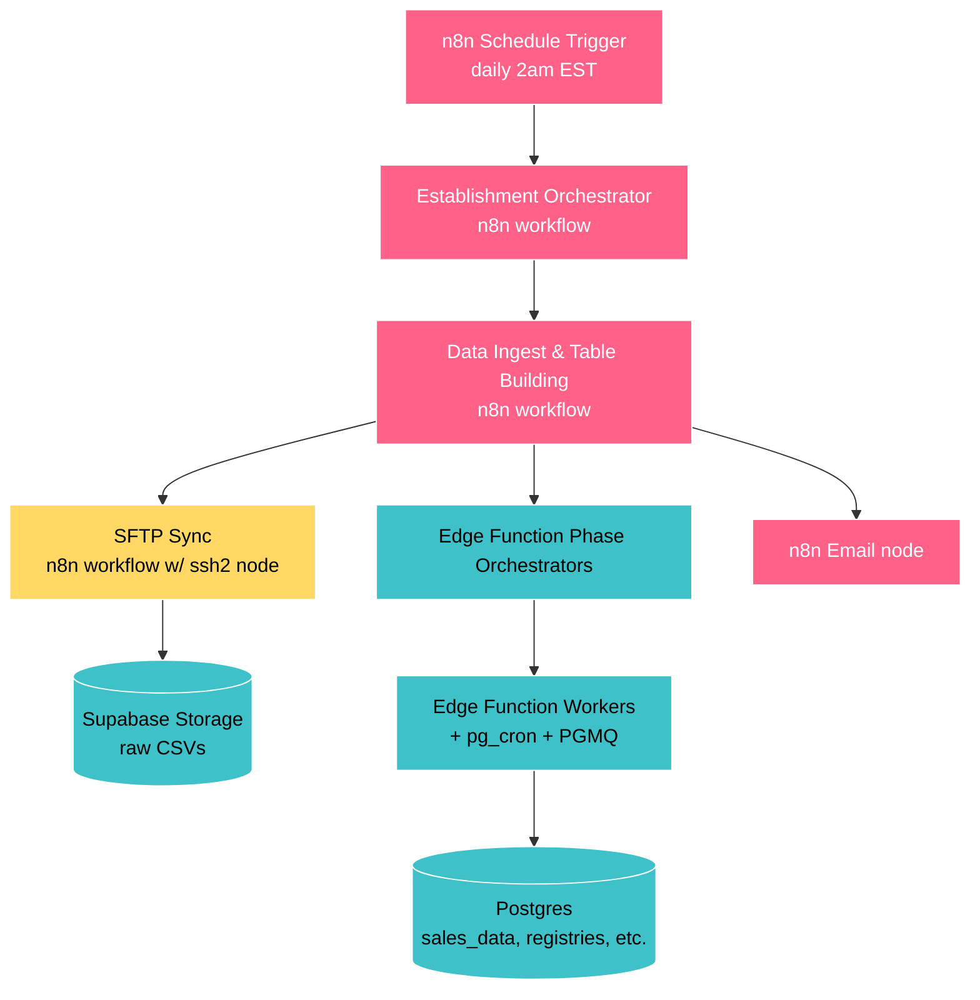
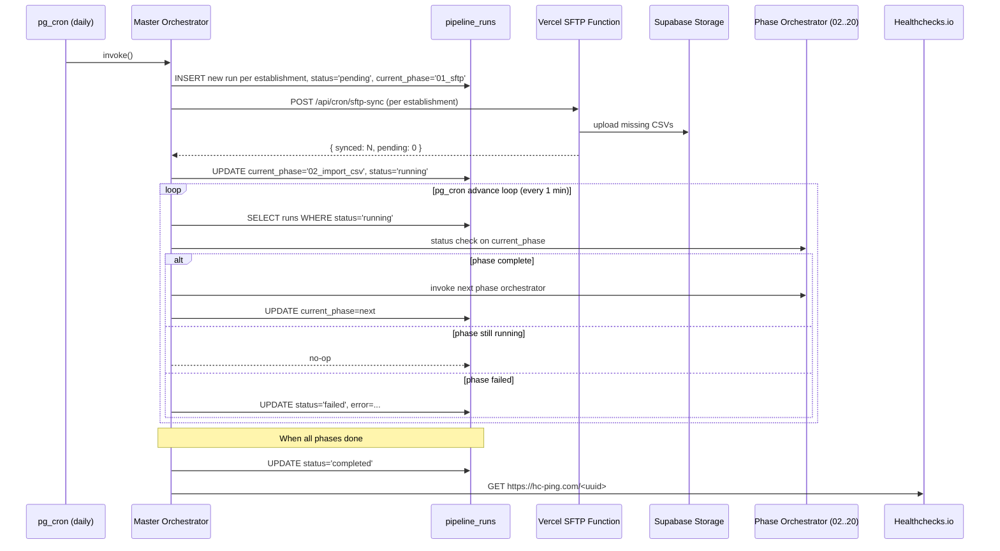

# Backend Migration: n8n → data_acquisition_and_processing

Status: Draft v1 — pending review. Branch: feat/replace-n8n. Author: Architecture. Last updated: 2026-04-21.
Target: backend/workflows/data_acquisition_and_processing/ (to be created). Decommission: backend/workflows/menu_registry_and_backfill/ (at the end of the migration).

## Context from the previous session

This migration replaces n8n orchestration with pg_cron plus a state machine plus a Vercel SFTP worker. Roughly 90% of the heavy lifting already lives in Supabase Edge Functions, RPCs, and PGMQ; n8n is effectively a "fancy UI for calling Edge Functions". The new code lives in `backend/workflows/data_acquisition_and_processing/` (built alongside production), which leads to decommissioning `backend/workflows/menu_registry_and_backfill/` at the end. The migration is glue replacement, not algorithm replacement.

## 1. Executive summary

New system components:

- A master_orchestrator Edge Function triggered by pg_cron; drives the pipeline through phases.
- A Vercel cron plus serverless function for SFTP ingestion (the only step Supabase Edge Functions cannot do).
- The existing PGMQ plus worker pattern (which already powers 7 current phases) extended to the remaining phases.
- An independent heartbeat monitor (Healthchecks.io) — the system cannot silently fail.
- An admin dashboard in the Next.js frontend: pipeline state, run history, and per-phase progress.

## 2. Why

### Trigger

2026-04-13: the n8n "Establishment Orchestrator" failed every morning at the `Filter Nightly Sync` Code node.
Error: `Task request timed out after 60 seconds` (n8n Cloud TaskRunner subprocess).
Result: the pipeline silently produced no data for 1 week; discovered at the 2026-04-21 weekly report meeting.

### Silent failure equals architectural defect

```text
n8n Code node fails to start
    ↓
nothing downstream runs
    ↓
nothing reaches the "send error email" node (which is also in n8n)
    ↓
no alert is ever sent
```

The system depends on itself to report its own failure, which leads to the requirement for an independent heartbeat; it must fire when expected work does *not* happen; it must be hosted outside the monitored pipeline.

### Why move off n8n (the immediate bug was fixed by upgrading to n8n Cloud 2.17.3)

1. A single-maintainer visual editor does not compose with AI-assisted development; code-first workflows are diff-able and reviewable and AI-editable.
2. n8n Cloud has compounding reliability issues (TaskRunner beta, MCP server gaps, frequent breaking releases).
3. Onboarding new establishments is imminent, which leads to migrating before multi-tenant, not after.
4. n8n's actual job is the cron trigger plus sequencing phases plus polling for "done" plus sending email, which leads to a small surface, reproducible in pg_cron plus a state machine in roughly hundreds of lines.
5. The admin dashboard (system health, multi-tenant operational view) is something we wanted anyway.

### What stays in n8n during the migration

Nothing. Full replacement on the feat/replace-n8n branch, which leads to parity validation in shadow mode, which leads to cutover. n8n runs in production until cutover day, which leads to it being archived and turned off.

## For reference (look up as needed, not on every load)

## 3. Current state

### 3.1 Architecture (current)

Hybrid: n8n (orchestration) plus Supabase (heavy lifting).



### 3.2 Phases already off n8n

Running as Edge Function orchestrators plus pg_cron workers plus PGMQ queues (n8n only kicks them off and polls status):

- 02 — `import_csv_to_database`
- 06 — `backfill_menu_group_ids`
- 09 — `backfill_wine_ids`
- 10 — `backfill_menu_item_ids`
- 11 — `daily_loss_items`
- 12 — `sales_data_aggregated`
- 13 — `order_rounds`

This is the proven Day-Based Worker Pipeline pattern: resumable, observable, fault-tolerant, with months in production.
For reference: `DAY_BASED_WORKER_PIPELINE.md`.

### 3.3 Remaining n8n surface

| Responsibility | Where | Replacement |
|---|---|---|
| Daily 2am EST trigger | n8n Schedule Trigger | pg_cron (Postgres) |
| Per-establishment fan-out | Filter Nightly Sync Code node + loop | master_orchestrator Edge Function (SQL query) |
| Phase sequencing | Data Ingest & Table Building workflow nodes | pipeline_runs state machine + pg_cron advance |
| Poll orchestrators for "done" | n8n loop + httpRequest nodes | advance loop (pg_cron every minute) |
| **SFTP → Supabase Storage** | n8n SFTP nodes | **Vercel cron + serverless SFTP worker** (only piece needing non-Supabase compute) |
| Failure email | n8n Email node | Healthchecks.io alert + dashboard alerts |

### 3.4 Documentation map (current system)

For reference, read in this order:

1. [DAILY_AND_ONBOARDING_OVERVIEW.md](../../backend/workflows/menu_registry_and_backfill/DAILY_AND_ONBOARDING_OVERVIEW.md) — hybrid orchestration, daily vs onboarding modes, error handling.
2. [reports/PIPELINE_DIAGRAMS.md](../../backend/workflows/menu_registry_and_backfill/reports/PIPELINE_DIAGRAMS.md) — 6 mermaid diagrams (full pipeline, registry/dedupe, companion tables, settings→phase routing, PGMQ pattern, table lineage).
3. [DAY_BASED_WORKER_PIPELINE.md](../../backend/workflows/menu_registry_and_backfill/DAY_BASED_WORKER_PIPELINE.md) — the PGMQ plus pg_cron plus Edge Function pattern powering most phases (preserved in the new system).
4. [README_MENU_REGISTRY_AND_BACKFILL.md](../../backend/workflows/menu_registry_and_backfill/README_MENU_REGISTRY_AND_BACKFILL.md) — index of all 21 phases with links and implementation type.

For reference, per-phase entry points:

- Phase 00 (n8n, REPLACING): [README_ORCHESTRATOR.md](../../backend/workflows/menu_registry_and_backfill/00_ESTABLISHMENT_ORCHESTRATOR/README_ORCHESTRATOR.md)
- Phase 01 (n8n, REPLACING): [README_DATA_SYNC.md](../../backend/workflows/menu_registry_and_backfill/01_DATA_SYNC/README_DATA_SYNC.md)
- Phases 02–20: per-phase READMEs in menu_registry_and_backfill/ (implementation unchanged; only the trigger changes).

For reference, live n8n workflow JSON (will be archived):

- [`00_ESTABLISHMENT_ORCHESTRATOR/code/n8n/01_daily_establishment_orchestrator.json`](../../backend/workflows/menu_registry_and_backfill/00_ESTABLISHMENT_ORCHESTRATOR/code/n8n/01_daily_establishment_orchestrator.json)
- [`01_DATA_SYNC/code/n8n/soviet_sync_v02.json`](../../backend/workflows/menu_registry_and_backfill/01_DATA_SYNC/code/n8n/soviet_sync_v02.json) — the SFTP workflow (hardest to replace).
- "Data Ingest and Table Building Pipeline" — in n8n Cloud; export to repo before cutover if not done.

For reference, supplementary:

- [`backend/workflows/WORKFLOWS_OVERVIEW.md`](../../backend/workflows/WORKFLOWS_OVERVIEW.md)
- Schema docs under [`shared/database/schema/`](../../shared/database/schema/)
- Workspace rule: `multi-tenant-no-hardcoding.mdc`
- Workspace rule: `sales-data-immutability.mdc`

### 3.5 Documentation gaps (the new system must produce)

- Master orchestrator design doc (state machine, pipeline_runs table, advance loop).
- SFTP service deployment doc (Vercel function, env vars, retry/backoff, chunked onboarding).
- Heartbeat and alerting doc (Healthchecks.io integration, alert routing, escalation).
- Admin dashboard doc (data sources, RLS, components).
- Cutover runbook (day-of procedure).
- Decommissioning checklist (what to archive, what to delete from n8n Cloud).

## 4. Target architecture

### 4.1 Component overview

```mermaid
flowchart TB
    classDef vercel fill:#000000,stroke:#fff,color:#fff
    classDef supa fill:#3FC1C9,stroke:#fff,color:#000
    classDef pg fill:#A9DC76,stroke:#fff,color:#000
    classDef ext fill:#AB9DF2,stroke:#fff,color:#000

    PgCronTrigger[pg_cron job<br/>daily 02:00 ET]:::pg
    PgCronAdvance[pg_cron advance loop<br/>every 1 min]:::pg
    PgCronHeartbeat[pg_cron heartbeat ping<br/>after each successful run]:::pg

    Master[Master Orchestrator<br/>Edge Function]:::supa
    Runs[(pipeline_runs<br/>state machine)]:::supa
    PhaseOrch[Existing Phase Orchestrators<br/>02..20]:::supa
    Workers[Existing PGMQ Workers]:::supa
    DB[(Postgres tables)]:::supa

    SftpCron[Vercel cron<br/>daily 02:00 ET]:::vercel
    SftpFn[/api/cron/sftp-sync<br/>Vercel Function<br/>chunked, idempotent]:::vercel
    Storage[(Supabase Storage<br/>raw CSVs)]:::supa

    HC[Healthchecks.io<br/>independent monitor]:::ext
    Dashboard[Next.js Admin Dashboard<br/>/admin/pipeline]:::vercel

    PgCronTrigger --> Master
    Master --> Runs
    PgCronAdvance --> Master
    Master -->|kicks off SFTP| SftpFn
    SftpCron -.fallback trigger.-> SftpFn
    SftpFn -->|raw CSVs| Storage
    Master -->|when SFTP done| PhaseOrch
    PhaseOrch --> Workers
    Workers --> DB
    PgCronHeartbeat --> HC
    HC -.alert if no ping.-> Owner[Owner + on-call]
    Dashboard --> Runs
    Dashboard --> DB
```

### 4.2 Daily run sequence



### 4.3 Design rationale

- No long-running processes: every component returns in seconds, and advancement is driven by polling (the same model as the existing PGMQ pipeline).
- Automatic recovery: a pipeline_runs row stuck in `running` past its expected window is picked up by the next advance loop tick; a failed phase is retryable without rerunning earlier phases.
- Healthchecks.io is genuinely independent: a separate service that alerts when it does *not* hear from us by a deadline; the pipeline cannot silence it by failing.
- Per-establishment isolation: one establishment's failure does not block others (each is its own pipeline_runs row).
- Multi-tenant from day one: the master_orchestrator queries establishments and respects `processing_config.nightly_sync`; establishment_id must never be hardcoded.

### 4.4 Heavy-phase performance patterns (preserved unchanged)

Heavy phases (for example, backfilling `menu_item_id` into `sales_data`, wine dedup, `sales_data_aggregated`, `order_rounds`):

Fan-out pattern per heavy phase:

1. The phase orchestrator fires a pg_cron job, which leads to processing roughly 60 days at a time.
2. Each chunk pushes per-day jobs into PGMQ.
3. Multiple workers pull from the queue and process days concurrently.
4. The phase status checker counts completed days versus total; the phase is "done" when the count matches.

The master_orchestrator does not care HOW a phase achieves completion; it only calls the phase orchestrator and polls the phase status checker.
Light phases run inline; heavy phases fan out internally.

Use caution: the advance loop polling interval (1 minute via the pg_cron advance loop) must be faster than the heavy phase's internal completion granularity. Today's polling is fine. If chunks ever shrink below 1 minute of work, this leads to needing to increase the advance-loop frequency.

Data point: a 10-minute weekly backfill (operator, 2026-04-21); nightly runs are fast, weekly catch-up takes minutes, full onboarding takes hours — all within the existing pattern's tolerance.

### 4.5 New components inventory

| Component | Lives in | Replaces |
|---|---|---|
| `pg_cron` daily trigger | `shared/database/migrations/<date>_pipeline_cron.sql` | n8n Schedule Trigger |
| `master_orchestrator` Edge Function | `supabase/functions/master_orchestrator/` | Establishment Orchestrator + Data Ingest workflow (n8n) |
| `pipeline_runs` table | `shared/database/migrations/<date>_pipeline_runs.sql` | n8n execution history |
| `pg_cron` advance loop (every minute) | same migration | n8n "wait + poll" nodes |
| `app/api/cron/sftp-sync/route.ts` | `frontend/app/api/cron/sftp-sync/` | n8n SFTP nodes + Soviet Sync workflow |
| `vercel.json` cron entry | `frontend/vercel.json` | n8n Schedule Trigger for SFTP |
| Healthchecks.io check | external service | (no current equivalent — net new) |
| admin dashboard | `frontend/app/admin/pipeline/` | manual n8n UI inspection |

## 5. SFTP decision

### 5.1 Constraint

Soviet delivers daily CSVs over SFTP. Supabase Edge Functions cannot make outbound TCP/SSH (Deno-on-Cloudflare runtime). This wall was confirmed when evaluated months ago, which leads to SFTP needing non-Supabase compute.

### 5.2 Options evaluated

| Option | Cost | Pros | Cons | Verdict |
|---|---|---|---|---|
| **A. Vercel cron + serverless** | $0 added (on Pro) | same project as frontend, deploys on `git push`, cron precision 1 min, Pro equals 800s duration with Fluid Compute, Node + ssh2-sftp-client native | per-invocation 800s ceiling, which leads to onboarding needing chunking; cold start ~1s | **PRIMARY RECOMMENDATION** |
| B. Small VPS (Fly.io/Railway/Hetzner) | $5/mo | no timeout, persistent SSH, always-on simplifies heartbeat | more to monitor, CI/CD overhead, vendor diversification | backup option |
| C. DreamHost cron | already paying | owned, no new vendor | shared plans do not fit, node availability spotty, low uptime confidence | skip |
| D. Third-party MFT-as-a-service (Files.com etc.) | $100–500+/mo | SLA-backed | wildly overkill, vendor lock-in | skip |
| E. GitHub Actions cron | $0 (private repo minutes) | zero infra, built-in logs | cron has 5–15 min drift (not predictable), on-demand needs GH API token, logs not in dashboard | skip primary; viable fallback trigger |
| F. AWS Lambda + EventBridge | ~$0 at our scale | mature, reliable | new vendor, new IAM, new deploy pipeline | skip |
| G. Cloudflare Workers | $0 | edge global | `cloudflare:sockets` exists but `ssh2-sftp-client` doesn't support it; a custom SFTP impl is needed | skip |

### 5.3 Recommended: Vercel cron plus chunked SFTP worker

Endpoint: `POST /api/cron/sftp-sync`
Inputs: `{ establishment_id: string, mode: "daily" | "onboarding", max_files?: number }`

Behavior:

1. Read the establishment SFTP config from `establishment_settings` (no hardcoding — the same rule as everywhere).
2. List remote SFTP folders for the date range:
   - `daily`: yesterday plus the last 3 days (catch-up window).
   - `onboarding`: from `data_start_date` to today.
3. Compare against data_processing_status to find missing files.
4. Process up to `max_files` (default 100, roughly 100s of work) per invocation.
5. For each file: download, which leads to uploading to Supabase Storage, which leads to INSERT into data_processing_status with `phase_01_status='completed'`.
6. Return `{ synced: N, pending: M, has_more: bool }`.

Daily mode: the Vercel cron fires once at 02:00 ET and calls the endpoint per establishment; the master_orchestrator also calls it as part of the pipeline_run start; both produce the same idempotent result.

Onboarding mode: the master_orchestrator calls the endpoint in a loop with `mode=onboarding, max_files=100`; each invocation handles roughly 100 files in roughly 100s and returns `has_more`; the loop continues until `has_more=false`; for 2800 files this is roughly 28 invocations over roughly 50 minutes (within Vercel cron's per-minute precision).

For reference: the same chunked-worker model as the existing PGMQ pipeline; the SFTP worker is conceptually the "phase 01 worker" living on Vercel due to the SFTP constraint.

### 5.4 SFTP-specific risks

- Soviet SFTP IP allowlisting: confirmed NOT in play (operator, 2026-04-21); Soviet SFTP auth via SSH key only, no source-IP restriction; Vercel-as-SFTP-host confirmed viable.
- Long onboarding runs: chunking handles them; rate limiting on Vercel function concurrency is needed to avoid hammering Soviet SFTP.
- Vercel cold starts: roughly 1s per cold start; negligible for daily; fine for onboarding.
- Single-vendor risk: a Vercel outage the same morning; Healthchecks.io (independent) catches it within hours.

For reference, future: Soviet API access (when granted), which leads to replacing the entire Vercel SFTP path with HTTPS calls, which leads to zero non-Supabase compute; keep the SFTP service modular (no SFTP details leak into the master_orchestrator).

## 6. Component-by-component migration map

### 6.1 Phase mapping

| Old (n8n) | New | Notes |
|---|---|---|
| Schedule Trigger (daily 2am) | `pg_cron` + Vercel cron | two triggers belt-and-suspenders; both invoke idempotent endpoints |
| Establishment Orchestrator | master_orchestrator Edge Function | queries `establishments` for `nightly_sync=true`, creates pipeline_runs rows |
| Filter Nightly Sync Code node | SQL `WHERE` in master_orchestrator | 30-line JS leads to 3 lines SQL |
| Soviet Sync (SFTP) | `frontend/app/api/cron/sftp-sync/route.ts` | chunked, idempotent, per-establishment |
| Data Ingest & Table Building | pipeline_runs state machine + advance loop | phase sequence equals data, not workflow nodes |
| Per-phase httpRequest nodes | master_orchestrator HTTP calls | same target Edge Functions, different caller |
| Per-phase status check loops | advance loop (every 1 min) reads phase status checker | same pattern, runs in pg_cron |
| Failure Email node | Healthchecks.io alert + dashboard alert + email via Resend | multiple independent paths |

### 6.2 Phase naming and ordering

Old system problem: folder names doubled as both sort hints and execution-order contract, which led to hitting `05B` when inserting between `05` and `06` (the BASIC line-number problem).

Fix (same as dbt/Dagster/Airflow):

1. Folder names are kebab-case with a leading number (filesystem sort only; spaced in 10s for insertion; never reference by number from code).
2. A manifest file at the workflow root is the source of truth for execution order; references phases by stable string IDs.

Folder layout for `backend/workflows/data_acquisition_and_processing/`:

```text
00-establishment-orchestrator/   # block 0  — entry / dispatch
10-data-sync/                    # block 10 — ingestion (Vercel SFTP)
12-data-import/                  #            (CSV → Postgres, PGMQ workers)
20-setup-and-validation/         # block 20 — preparation
30-menu-group-registry/          # block 30 — registry building
32-mark-exceptions/
34-classify-menu-groups/
36-backfill-menu-group-ids/
40-wine-registry/                # block 40 — wine
42-backfill-wine-ids/
50-menu-item-registry/           # block 50 — menu items
52-backfill-menu-item-ids/
60-daily-loss-items/             # block 60 — derived data / aggregations
62-sales-data-aggregated/
64-order-rounds/
66-availability-history/
68-daily-establishment-summary/
70-classify-job-titles/          # block 70 — employee
                                 # block 80 reserved for future expansion
90-heartbeat-and-alerting/       # block 90 — operational concerns
92-admin-dashboard/
```

Manifest at the workflow root — `backend/workflows/data_acquisition_and_processing/pipeline.yml`:

```yaml
version: 1
name: data_acquisition_and_processing
phases:
  - id: establishment_orchestrator
    dir: 00-establishment-orchestrator
    type: orchestrator
    next: data_sync

  - id: data_sync
    dir: 10-data-sync
    type: external_worker         # Vercel function
    next: data_import

  - id: data_import
    dir: 12-data-import
    type: pgmq_worker
    next: setup_and_validation

  - id: setup_and_validation
    dir: 20-setup-and-validation
    next: menu_group_registry

  - id: menu_group_registry
    dir: 30-menu-group-registry
    next: mark_exceptions

  # ... and so on. Each phase declares its successor by id.
  # Branching / fan-out can be expressed as `next: [a, b]` later if needed.

  - id: classify_job_titles
    dir: 70-classify-job-titles
    next: null                    # terminal phase
```

How it works:

- The master_orchestrator reads `pipeline.yml` once at startup, which leads to building a directed graph keyed by `id`; it never touches folder names.
- Add a phase: pick an unused number in the right block, which leads to creating the folder, which leads to adding a manifest entry, which leads to pointing the predecessor's `next` to the new id (no renames, no broken refs).
- Rename a folder: change `dir` in the manifest (code still references by `id`).
- Renumber a folder: change `dir` in the manifest.
- The folder list reads in execution order in any file browser (the only purpose of the leading number).
- The `id` is the contract; treat it like a database column name; never rename without a migration.

Per-phase folder contents:

```text
NN-phase-name/
├── README.md                    # what this phase does, inputs, outputs, error modes
├── code/                        # Edge Function source (or pointer to /supabase/functions/)
└── migrations/                  # any phase-specific migrations (rare; usually shared)
```

### 6.3 Database changes

Additive migrations only:

- pipeline_runs table: one row per (establishment, run_date) with current phase id, status, timestamps, error.
- `pipeline_phase_runs` table (optional): per-phase timing per run for the dashboard (defer to v2).
- pg_cron jobs: daily trigger plus advance loop.

No changes to existing tables. No migrations against `sales_data` (the immutability rule holds).

The `pipeline.yml` manifest is loaded by the master_orchestrator at function startup and cached for the duration of the invocation; changes take effect on the next cron tick. No DB migration is needed when the pipeline shape changes (the manifest IS the migration).

## 7. Phased rollout

Context from the previous session: the migration runs in shadow mode first; n8n stays running the entire time.

Timeline predictions (2026-04-21):

- Engineering estimate (assistant): 3–4 weeks across migration plus dashboard.
- Operator prediction: end of day 2026-04-22 (~30 hours from 2026-04-21).
- Actual: `<TBD>` (fill in completion timestamp when done).

Decision: skip the "stop the bleeding" Healthchecks.io-on-existing-n8n step; go straight to the new system; if n8n breaks before cutover, manual reruns plus next-morning discovery is acceptable risk for ~30 hours (operator) or ~3 weeks (assistant).

### Phase A — build new components in shadow (operator: days 1–2 / assistant: weeks 1–3)

Goal: stand up data_acquisition_and_processing/ infrastructure with no production impact.

- A1. Create `backend/workflows/data_acquisition_and_processing/` skeleton with `pipeline.yml` manifest.
- A2. Migration: pipeline_runs table.
- A3. Edge Function: master_orchestrator (basic — sequences phases, no error recovery yet).
- A4. Vercel function: `/api/cron/sftp-sync` (daily mode only).
- A5. pg_cron jobs (commented out / disabled initially).
- A6. Smoke test: manually trigger master_orchestrator for one establishment in test schema, which leads to confirming it can drive existing phase orchestrators end-to-end.

Exit: master_orchestrator completes a full per-establishment run against test data; results match n8n run on the same date.

### Phase B — shadow mode (operator: days 1–2 / assistant: weeks 3–4)

Goal: run the new pipeline against settled historical dates; prove zero-diff parity with n8n output.

Mechanism: no `shadow_mode` flag; no `*_shadow` schema. The existing pipeline is already idempotent on rerun. The new master_orchestrator runs against dates n8n processed days ago. If genuinely idempotent, the diff equals zero. A nonzero diff equals a bug in the master_orchestrator or a latent non-idempotency in an existing phase (both bugs worth finding before cutover).

- B1. Idempotency audit (precondition): for each phase 12–70, confirm that rerunning an already-completed date produces no row changes; document non-idempotent phases and fix before proceeding (valuable independent of the migration).
- B2. Pick a settled date (for example, 7 days ago); snapshot all relevant tables filtered to that date.
- B3. Manually trigger the new master_orchestrator for `(Fred's Italian Bistro, settled_date)`.
- B4. Diff post-snapshot vs pre-snapshot; expected: empty diff.
- B5. Repeat for 3 different settled dates.
- B6. Final confidence: trigger the new master_orchestrator for one fresh date AFTER n8n has fully completed it; diff again; expected: empty.

Exit: 3+ settled-date reruns equal zero diffs, plus 1 same-day post-n8n rerun equals zero diff.

Why this works: the existing system is idempotent (proven by months of operational reruns), which leads to shadow mode reducing to "did the new master_orchestrator change anything when it shouldn't have?" — a much sharper test than parallel execution plus reconciling timestamps.

### Phase C — cutover (the day after shadow validates)

Goal: switch production to the new pipeline.

- C1. Disable n8n Schedule Trigger.
- C2. Switch the new pipeline out of shadow mode (write to production tables).
- C3. Watch the next 3 daily runs closely.
- C4. Keep n8n workflow files in the repo plus the n8n Cloud account active for 2 weeks as a rollback.

Exit: 3 successful production runs from the new pipeline.

### Phase D — decommission (after 2 weeks of clean production runs)

Goal: clean up.

- D1. Archive n8n workflow JSONs to `_archive/<date>_n8n_workflows/`.
- D2. Delete workflows in the n8n Cloud account.
- D3. Cancel the n8n Cloud subscription (or downgrade to free).
- D4. Delete `backend/workflows/menu_registry_and_backfill/` entirely.
- D5. Update root `README.md`, `CLAUDE.md`, `QUICK_REFERENCE.md` (remove n8n references).

Exit: no n8n references anywhere in the repo or production stack.

### Phase E — admin dashboard (parallel track)

Goal: replace "log into n8n to see what happened" with a real dashboard.

- E1. `/admin/pipeline` route; gated to admin/superadmin/dev roles.
- E2. List of recent pipeline_runs with status, current phase, timing.
- E3. Drill-down per run: phase-by-phase progress, error details, retry button.
- E4. Live status of today's run across all establishments.
- E5. Healthchecks.io integration (manage check, surface alert state in UI).

Useful before cutover (pipeline_runs is populated in shadow mode), which leads to building it in parallel with Phase A/B by a separate workstream.

## 8. Risks and mitigations

| Risk | Impact | Likelihood | Mitigation |
|---|---|---|---|
| Shadow-mode diffs reveal logic differences | High | Medium | Phase C catches it; don't cut over until 5 clean days |
| Soviet requires fixed source IP for SFTP | High | Low | verify with Soviet first (Phase B1); fallback: small VPS |
| Vercel function timeout during onboarding chunk | Medium | Low | chunk size tuned under 800s; default 100 files (~100s) |
| Vercel + Supabase outage same day | High | Very Low | Healthchecks.io independent; alerted within hours |
| pg_cron advance loop falls behind | Medium | Low | loop equals 1 min; phase orchestrators async; minimal impact |
| master_orchestrator bug, all establishments break | High | Medium | start with one establishment (Fred's Italian Bistro) for 1 week before adding others |
| Decommission menu_registry_and_backfill/ too early | Medium | Low | don't delete until 2 weeks post-cutover; keep n8n workflow JSONs in `_archive/` permanently |
| New person cannot find docs (folder name changed) | Low | Medium | update root README + CLAUDE.md in Phase E5; add forwarding pointer in `_archive/` |

## 9. Shared contracts (single source of truth; both workstreams)

In every turn: changes to this section must be reflected here before either workstream codes against them.

### 9.1 Workstream ownership

Backend chat owns (writes):

- `supabase/functions/master_orchestrator/` — the master_orchestrator Edge Function.
- `supabase/functions/<phase_name>/` — new phase orchestrators, status checkers, workers.
- `frontend/app/api/cron/sftp-sync/route.ts` — the Vercel SFTP worker (lives in `frontend/` for Vercel deploy; server-side backend code).
- `frontend/vercel.json` — cron entries for the SFTP worker.
- `shared/database/migrations/` — pipeline_runs table, pg_cron jobs, other migrations.
- `backend/workflows/data_acquisition_and_processing/` — the entire new workflow folder including phase READMEs plus `pipeline.yml`.
- Healthchecks.io outbound ping in the master_orchestrator (env-var-gated, ~10 lines).
- "rerun phase" Edge Function endpoint for the dashboard retry button (see 9.4).

Frontend chat owns (writes):

- `frontend/app/admin/pipeline/` — the entire admin dashboard route.
- `frontend/components/admin/` — new admin-only UI components.
- `frontend/lib/admin/` — new admin-only client utilities.
- Healthchecks.io account, check, alert routing (configured at healthchecks.io, not in code).
- UI for surfacing alert state, run drill-downs, retry buttons.
- Read-side queries against pipeline_runs (consume only).

Neither workstream owns (deferred / out of scope):

- Resend / email routing implementation (Healthchecks.io native email is sufficient for v1).
- SMS escalation.
- Multi-user alert distribution list (defer until post-cutover).
- Onboarding workflow UI (separate feature).

### 9.2 pipeline_runs table contract

Two ledgers, two granularities:

| Table | Granularity | Owner | Purpose |
|---|---|---|---|
| pipeline_runs (NEW) | one row per (establishment_id, run_date, mode) | master_orchestrator writes | orchestration ledger — tracks which phase the master_orchestrator is currently driving |
| data_processing_status (EXISTING, unchanged) | one row per (establishment_id, date) with per-phase status columns | individual phase workers update their own column | per-phase work ledger — tracks what work each phase completed for that date |

The master_orchestrator reads data_processing_status to decide "is the current phase done?" and writes pipeline_runs to record "we're now on phase X".
The dashboard shows both: pipeline_runs answers "what is the master_orchestrator doing right now?" and data_processing_status answers "what work has each phase completed for this date?".

Backend chat creates the pipeline_runs migration; frontend chat consumes read-only (except retry via the 9.4 endpoint).
In every turn: the backend chat may add pipeline_runs columns; the backend chat must not rename or remove columns without a coordinated update to this section.

```sql
CREATE TABLE pipeline_runs (
  id                  UUID PRIMARY KEY DEFAULT gen_random_uuid(),
  establishment_id    UUID NOT NULL REFERENCES establishments(establishment_id),
  run_date            DATE NOT NULL,                  -- the business date this run is processing
  mode                TEXT NOT NULL,                  -- 'daily' | 'onboarding' | 'manual'
  status              TEXT NOT NULL,                  -- 'pending' | 'running' | 'completed' | 'failed' | 'cancelled'
  current_phase_id    TEXT,                           -- stable phase id from pipeline.yml; NULL when status='pending' or 'completed'
  started_at          TIMESTAMPTZ,
  completed_at        TIMESTAMPTZ,
  error_message       TEXT,
  error_phase_id      TEXT,                           -- which phase failed (if any)
  triggered_by        TEXT NOT NULL,                  -- 'pg_cron' | 'manual' | 'retry' | 'onboarding'
  metadata            JSONB DEFAULT '{}',             -- flexible space for phase-specific state
  created_at          TIMESTAMPTZ NOT NULL DEFAULT NOW(),
  updated_at          TIMESTAMPTZ NOT NULL DEFAULT NOW(),
  UNIQUE (establishment_id, run_date, mode)           -- one run per establishment per date per mode
);

CREATE INDEX idx_pipeline_runs_status ON pipeline_runs(status) WHERE status IN ('pending', 'running');
CREATE INDEX idx_pipeline_runs_recent ON pipeline_runs(created_at DESC);
```

Status state machine:

```text
pending → running → completed
              ↓
            failed → (retry creates new run with triggered_by='retry')
              ↓
          cancelled (only via manual override)
```

Optional v2: `pipeline_phase_runs` table (per-phase timing per run) — defer until the dashboard demands it; the backend chat owns the migration; the frontend chat consumes read-only.

### 9.3 Environment variables

The operator provides Healthchecks.io values from account setup (see §11); backend devs set them in the Supabase function env; frontend devs set them in the Vercel project env.

| Variable | Provided by | Consumer | Required? | Purpose |
|---|---|---|---|---|
| `HEALTHCHECKS_PING_URL` | operator (from healthchecks.io) | backend (master_orchestrator emits ping at end of run) | no — no-ops silently if unset | outbound success heartbeat |
| `HEALTHCHECKS_CHECK_UUID` | operator (UUID part of ping URL) | frontend (HeartbeatBanner reads check status) | no — banner shows "not configured" if unset | identifies the check for read API calls |
| `HEALTHCHECKS_READ_API_KEY` | operator (read-only API key from healthchecks.io) | frontend (HeartbeatBanner reads check status) | no — banner shows "not configured" if unset | auth for the Healthchecks.io read API |
| `MASTER_ORCHESTRATOR_URL` | backend chat (after deploy) | frontend (dashboard retry button proxy) | required once retry button ships | base URL for the master_orchestrator Edge Function (no trailing slash, no `/retry` suffix) |
| `SUPABASE_SERVICE_ROLE_KEY` | already exists | both | already exists | RPC + admin reads |

SFTP credentials per establishment: `establishment_settings.soviet_config.sftp_credentials_key`, which leads to Supabase Vault; never env vars; the no-hardcoding rule is unchanged.

### 9.4 Retry endpoint contract

The backend chat exposes:

```text
POST /functions/v1/master_orchestrator/retry
Authorization: Bearer <user JWT with admin/superadmin/dev role>
Body: {
  "pipeline_run_id": "uuid",
  "from_phase_id": "<phase_id>" | null    // null = restart from current_phase_id
}
Response: {
  "new_pipeline_run_id": "uuid",
  "status": "pending"
}
```

Behavior: creates a NEW pipeline_runs row with `triggered_by='retry'`, links to the original via `metadata.retried_from=<original_run_id>`. The original row is left untouched. The frontend chat builds a button that calls this and updates the dashboard.

### 9.5 Concurrency rules

In every turn: one in-flight pipeline_runs row per (establishment_id, run_date, mode) at a time; enforced by the UNIQUE constraint; the master_orchestrator must check before starting.
In every turn: stuck-run timeout — a `running` row with `started_at` older than 6 hours is considered abandoned, which leads to the advance loop marking it `failed` with `error_message='timeout'`, which leads to allowing new runs.
In every turn: cron fires while the previous run is in progress — the master_orchestrator detects the existing `running` row, which leads to logging and returning a no-op; it must NOT start a duplicate.
In every turn: onboarding does not block daily — distinct rows (UNIQUE includes `mode`), which leads to onboarding for a date range and daily for today being able to run concurrently.

### 9.6 Shadow-mode strategy

For reference: see §7 Phase B; no shadow flag, no shadow schema; the dashboard shows whatever is in pipeline_runs.

### 9.7 Phase IDs are stable

In every turn: the `id` field in `pipeline.yml` (for example, `data_sync`, `menu_group_registry`) is a contract; both chats reference phases by id.
In every turn: renaming an id is a breaking change requiring a coordinated update; adding a new phase is non-breaking.

## For reference (look up as needed, not on every load)

## 10. Open questions and decisions

Tracked so developers do not get blocked; all decisions dated 2026-04-21 unless noted.

1. ~~Soviet SFTP IP allowlisting~~ **RESOLVED**: no IP allowlisting; SSH key auth only; Vercel-as-SFTP-host confirmed viable.
2. ~~Email delivery~~ **DEFERRED**: Healthchecks.io native email sufficient for v1; Resend deferred post-cutover.
3. ~~Healthchecks.io plan~~ **RESOLVED — FREE TIER**: 20 checks ceiling far above need; SMS escalation deferred; upgrade only if a real need surfaces.
4. ~~`pipeline_runs` retention~~ **RESOLVED — KEEP FOREVER**: ~365 rows/year/establishment equals trivial; no partitioning/dropping.
5. ~~Per-establishment runtime budget~~ **RESOLVED — DAILY RUN MUST COMPLETE BY 06:00 ET**: 4 hours after the 02:00 trigger; the Healthchecks.io grace window; alert fires if a run misses 06:00.
6. ~~Onboarding throttling~~ **RESOLVED — 1 SFTP INVOCATION EVERY 30 SECONDS**: conservative starting point for `mode=onboarding`; tune up if Soviet tolerates it.
7. ~~Alert distribution list~~ **RESOLVED — OPERATOR-ONLY FOR V1**: single recipient for v1; add a second contact post-cutover when known.
8. Soviet API access: when granted, which leads to replacing the entire Vercel SFTP service with HTTPS calls, which leads to zero non-Supabase compute; build the SFTP service modular (single-responsibility worker; SFTP details must not leak into the master_orchestrator); informational, not blocking.

## 11. Healthchecks.io setup (the operator does this once, ~5 minutes)

Performed by the operator under their own account (alert emails go to the inbox directly, no forwarding chain).

1. Sign up at <https://healthchecks.io/> using `admin@example.com`.
2. Create a check named **"Production data pipeline"**.
3. Schedule:
   - Type: **Simple**
   - Period: **24 hours** (the pipeline pings once per successful daily run)
   - Grace time: **4 hours** (alert fires if no ping by 06:00 ET given a 02:00 ET trigger)
4. Save the check; copy the ping URL (`https://hc-ping.com/<uuid>`).
5. Settings → API Access: create a **read-only API key**.
6. Provide to the development chats:
   - `HEALTHCHECKS_PING_URL` equals the full URL from step 4, sent to the backend chat (Supabase Edge Function env).
   - `HEALTHCHECKS_CHECK_UUID` equals the `<uuid>` part only, sent to the frontend chat (Vercel env).
   - `HEALTHCHECKS_READ_API_KEY` equals the key from step 5, sent to the frontend chat (Vercel env).

Until they are provided: both the backend ping and the frontend HeartbeatBanner no-op gracefully (no errors, no broken UI).

Post-cutover optional:

- Add a second email recipient (Open Question 7).
- Hobbyist plan ($5/mo) if SMS escalation is needed.

## 12. Reference links

### Documentation that fed this plan

- [DAILY_AND_ONBOARDING_OVERVIEW.md](../../backend/workflows/menu_registry_and_backfill/DAILY_AND_ONBOARDING_OVERVIEW.md)
- [PIPELINE_DIAGRAMS.md](../../backend/workflows/menu_registry_and_backfill/reports/PIPELINE_DIAGRAMS.md)
- [DAY_BASED_WORKER_PIPELINE.md](../../backend/workflows/menu_registry_and_backfill/DAY_BASED_WORKER_PIPELINE.md)
- [README_MENU_REGISTRY_AND_BACKFILL.md](../../backend/workflows/menu_registry_and_backfill/README_MENU_REGISTRY_AND_BACKFILL.md)
- [README_ORCHESTRATOR.md](../../backend/workflows/menu_registry_and_backfill/00_ESTABLISHMENT_ORCHESTRATOR/README_ORCHESTRATOR.md)
- [README_DATA_SYNC.md](../../backend/workflows/menu_registry_and_backfill/01_DATA_SYNC/README_DATA_SYNC.md)
- [`soviet_sync_v02.json`](../../backend/workflows/menu_registry_and_backfill/01_DATA_SYNC/code/n8n/soviet_sync_v02.json)
- [`01_daily_establishment_orchestrator.json`](../../backend/workflows/menu_registry_and_backfill/00_ESTABLISHMENT_ORCHESTRATOR/code/n8n/01_daily_establishment_orchestrator.json)

### External references

- [Vercel Functions duration limits](https://vercel.com/docs/functions/limitations)
- [Vercel cron jobs](https://vercel.com/docs/cron-jobs)
- [Healthchecks.io](https://healthchecks.io/)
- [Supabase pg_cron](https://supabase.com/docs/guides/database/extensions/pg_cron)
- [ssh2-sftp-client](https://www.npmjs.com/package/ssh2-sftp-client)

## Appendix A — why not Inngest, Trigger.dev, Temporal

Decision: not worth it for our shape of work.

- The pipeline equals a roughly 15-step linear DAG (not branching workflows with complex parallel or conditional logic).
- The PGMQ plus pg_cron plus worker pattern already handles fan-out, retries, and resumability for heavy phases.
- Adding Inngest or Trigger.dev equals another vendor, auth model, deploy pipeline, billing line, and AI learning surface.
- The custom state machine in pipeline_runs equals roughly 200 lines of SQL plus roughly 300 lines of Edge Function code; maintainable by one person.

Revisit only if: dozens of branching workflows with complex retry semantics; for now: boring and Postgres-native.

## Appendix B — why not stay on n8n with better monitoring

The Healthchecks.io heartbeat (Phase A) closes the silent-failure hole regardless of platform; if that were the only problem, stop there.

Reasons to migrate anyway:

1. Maintainer ergonomics: code-first beats visual editor for AI-assisted development.
2. Reliability: n8n Cloud equals a multi-year track record of breaking releases (TaskRunner equals the latest).
3. Vendor consolidation: removing n8n leads to Supabase plus Vercel only (2 vendors, not 3).
4. Cost: n8n Cloud subscription eliminated.
5. Fewer things to learn: every contributor (human or AI) needs n8n quirks today; tomorrow equals SQL plus TypeScript (likely already known).

Migration cost (3–4 weeks) is recouped within months in maintenance time saved.
